如果只有一台后端服务器，Nginx 的反向代理非常简单：
```nginx
location /api/ {
  proxy_pass http://backend:3000;
}
```
请求链路就是：
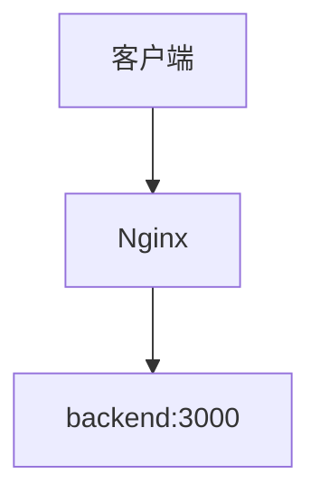
但真实生产环境通常不会只有一个后端实例。

可能是：
- backend1
- backend2
- backend3

这时就出现了新的问题：
> 一个请求到达 Nginx 后，到底应该交给哪一个 Backend？

这就是 **Nginx upstream 和负载均衡** 要解决的问题。

## 一、先理解什么是负载均衡
假设我们的系统只有一个 Backend：`backend1`，客户端 → Nginx → :3000
如果大量请求全部进入 backend1：
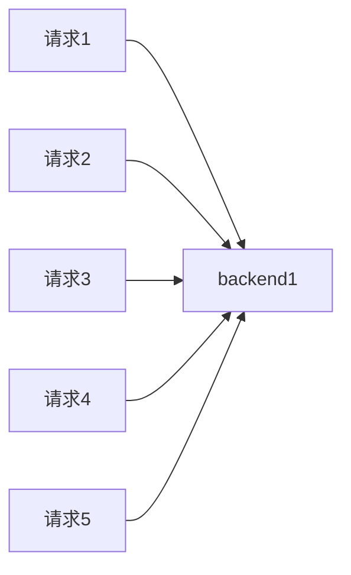
backend1 的压力会越来越大。

如果增加三个实例：
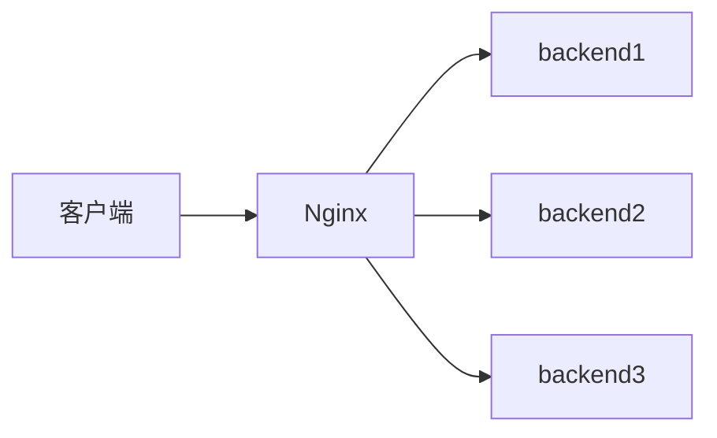
Nginx 就可以把请求分散出去：
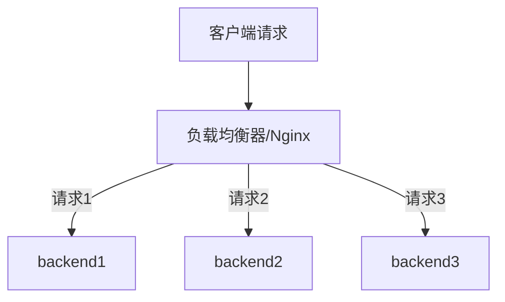
这就是最基础的负载均衡。

负载均衡主要解决三件事情：
- **请求分摊**
- **服务扩展**
- **一定程度的故障容忍**

不过这里必须先纠正一个常见误区：
> 有负载均衡，不代表系统就一定高可用。

例如三个 Backend 全部运行在同一台物理服务器：
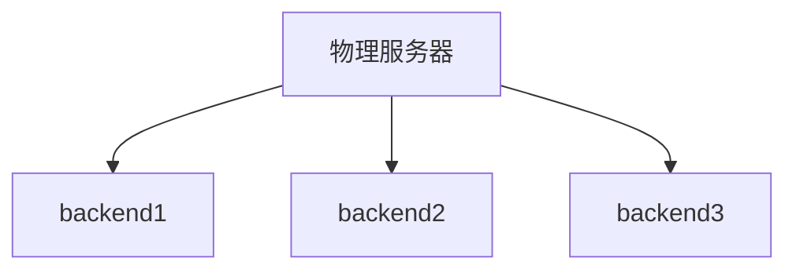
如果这台服务器断电，三个 Backend 会一起挂掉。

所以：**负载均衡 ≠ 完整高可用**

## 二、upstream 是什么？
Nginx 可以通过 upstream 定义一组后端服务器：
```nginx
upstream backend_cluster {
  server backend1:3000;
  server backend2:3000;
  server backend3:3000;
}
```
然后：
```nginx
location /api/ {
  proxy_pass http://backend_cluster;
}
```
完整链路变成：
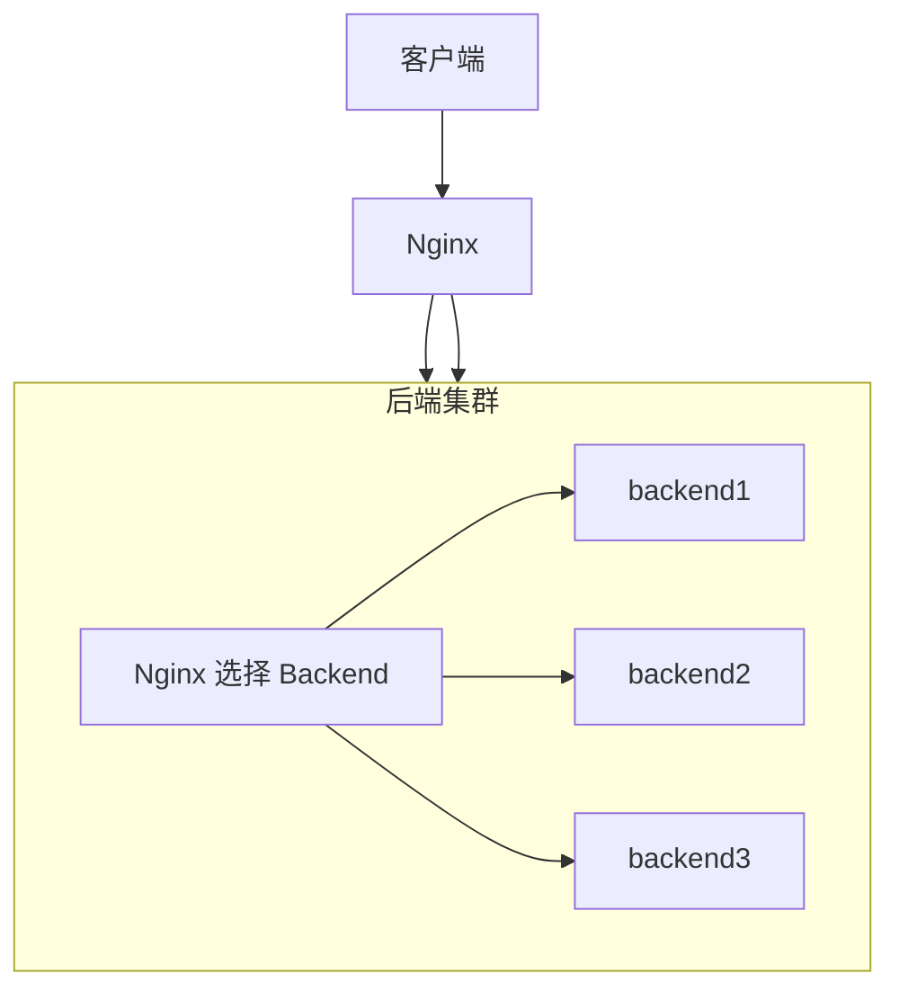
这里最重要的是分清两个名字：
`backend_cluster` 和 `backend1` 完全不是一回事。

### 2.1 backend_cluster 是什么？
```nginx
upstream backend_cluster {}
```
这里的：
```text
backend_cluster
```
只是 **Nginx 自己定义的 upstream 逻辑组名**。

你完全可以改成：
```nginx
upstream user_servers {}
```
然后：
```nginx
proxy_pass http://user_servers;
```
它：
- 不是 Docker 容器名。
- 不是 Compose Service Name。
- 不是 DNS 域名。
- 不是服务器 IP。

它只是：
> Nginx 对一组 Backend 起的名字。

### 2.2 backend1 是什么？
```nginx
server backend1:3000;
```
这里的：
```text
backend1
```
必须能够真正解析到某一个 Backend 地址。

在我们的 Docker Compose 环境中：
```text
backend1
backend2
backend3
```
都是 Compose Service Name，同时可以通过 Docker DNS 解析。

因此：
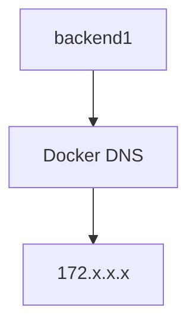

## 三、upstream 和 Docker DNS 的关系
这是学习 Docker + Nginx 时非常容易混淆的地方。

一句话记住：
> upstream 负责选谁，Docker DNS 负责找到谁。

例如：
```nginx
upstream backend_cluster {
  server backend1:3000;
  server backend2:3000;
  server backend3:3000;
}
```
假设 Nginx 这次选择：
```text
backend2:3000
```
接下来：
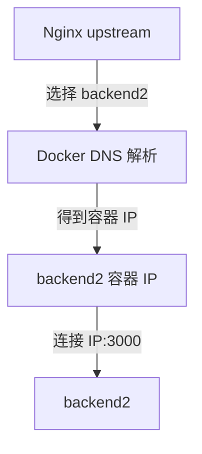
所以二者职责不同：
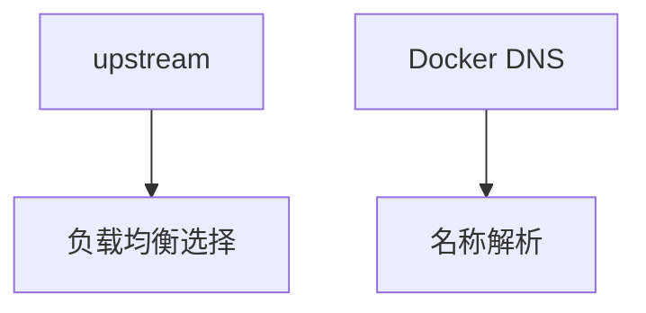

## 四、为什么不用容器 IP？
假设 Docker 当前分配：
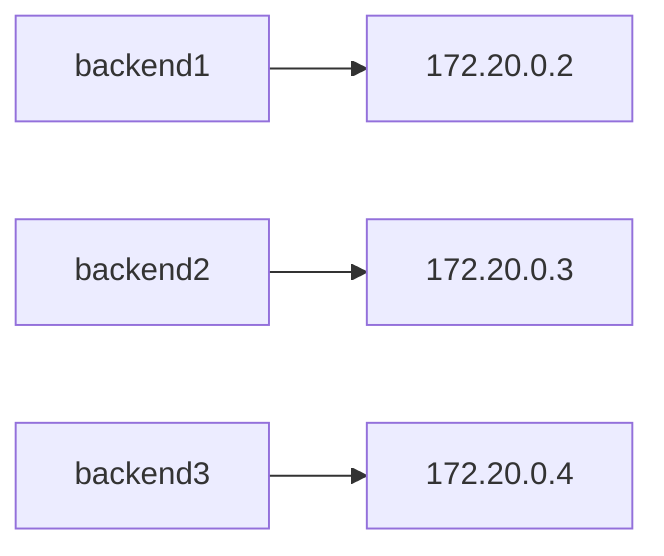
如果我们直接配置：
```nginx
server 172.20.0.3:3000;
```
问题是：

backend2 被删除并重新创建后：
```text
backend2 → 172.20.0.8
```
旧配置：
```text
172.20.0.3
```
就失效了。

所以 Docker 环境中通常使用：
```nginx
server backend2:3000;
```
而不是固定容器 IP。

名称比容器 IP 更稳定。

## 五、实验项目架构
我们搭建：
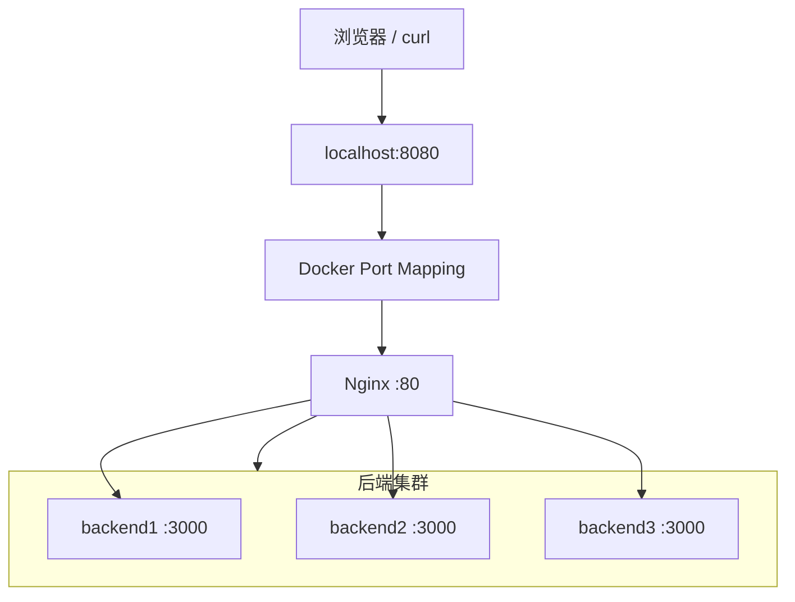
项目目录：
```text
nginx-stage1-chapter4/
├── docker-compose.yml
├── nginx/
│   └── conf.d/
│       └── default.conf
└── backend/
    ├── Dockerfile
    └── server.js
```

## 六、创建 Backend
创建：`backend/server.js`
```javascript
const http = require('http');

// 从环境变量中读取服务名称，默认为 'unknown'
const PORT = 3000;
const SERVER_NAME = process.env.SERVER_NAME || 'unknown';

const server = http.createServer((req, res) => {
  // 打印请求日志
  console.log(
    `[${SERVER_NAME}] ${req.method} ${req.url} from ${req.socket.remoteAddress}`
  );

  // 设置统一的响应头
  res.setHeader('Content-Type', 'application/json; charset=utf-8');

  // 路由: /server - 返回当前服务器名称
  if (req.url === '/server') {
    res.end(JSON.stringify({ server: SERVER_NAME }));
    return;
  }

  // 路由: /health - 健康检查接口
  if (req.url === '/health') {
    res.end(JSON.stringify({ status: 'ok', server: SERVER_NAME }));
    return;
  }

  // 路由: /request-info - 返回请求的详细信息
  if (req.url === '/request-info') {
    res.end(
      JSON.stringify({
        server: SERVER_NAME,
        method: req.method,
        url: req.url,
        host: req.headers.host,
        xRealIp: req.headers['x-real-ip'],
        xForwardedFor: req.headers['x-forwarded-for'],
        xForwardedProto: req.headers['x-forwarded-proto'],
      })
    );
    return;
  }

  // 兜底: 404 Not Found
  res.statusCode = 404;
  res.end(
    JSON.stringify({
      error: 'Not Found',
      server: SERVER_NAME,
    })
  );
});

// 监听 0.0.0.0 允许外部访问（在 Docker 中非常重要）
server.listen(PORT, '0.0.0.0', () => {
  console.log(`[${SERVER_NAME}] listening on ${PORT}`);
});
```
这里使用：
```
process.env.SERVER_NAME
```
区分不同 Backend。

虽然三个容器使用完全相同的镜像，但是：
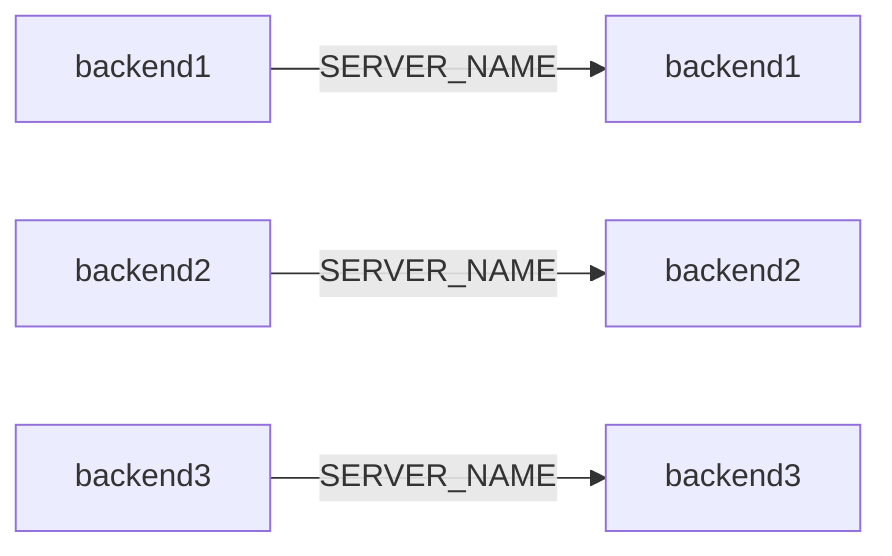
因此访问：
```text
/server
```
就可以知道请求最终落在哪个 Backend。

## 七、创建 Backend 镜像
创建：`backend/Dockerfile`
```dockerfile
FROM node:22-alpine

WORKDIR /app

COPY server.js .

EXPOSE 3000

CMD ["node", "server.js"]
```
构建：
```bash
docker build -t nginx-cluster:1.0 ./backend
```
检查：
```bash
docker images | grep nginx-cluster
```

## 八、Docker 中三个 Backend 为什么都能监听 3000？
这是理解整个实验的基础。

三个容器：
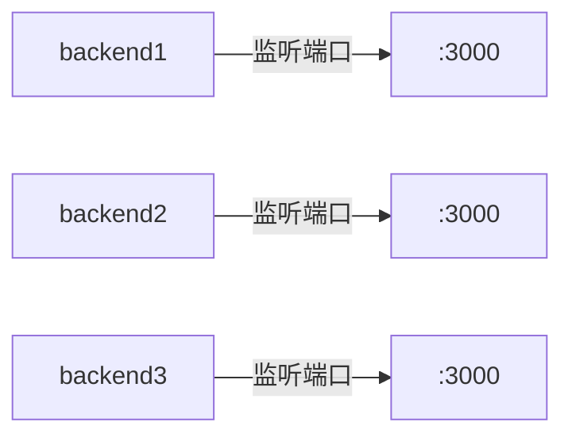
不会发生端口冲突。

因为每个容器都有自己的网络空间。

可以简单理解成：
```text
172.20.0.2:3000
172.20.0.3:3000
172.20.0.4:3000
```
IP 不同，因此端口可以相同。

真正会冲突的是：
```yaml
ports:
  - "3000:3000"
```
如果三个容器都这样配置：
```text
宿主机:3000 → backend1:3000
宿主机:3000 → backend2:3000
宿主机:3000 → backend3:3000
```
宿主机只有一个 3000，自然会发生端口冲突。

## 九、创建 Docker Compose
```yaml
services:
  nginx:
    image: nginx:1.28
    ports:
      - "8080:80"
    volumes:
      - ./nginx/conf.d/default.conf:/etc/nginx/conf.d/default.conf:ro
    depends_on:
      - backend1
      - backend2
      - backend3

  backend1:
    image: backend-new-dl:1.0
    environment:
      SERVER_NAME: backend1

  backend2:
    image: backend-new-dl:1.0
    environment:
      SERVER_NAME: backend2

  backend3:
    image: backend-new-dl:1.0
    environment:
      SERVER_NAME: backend3
```
注意三个 Backend 都没有：
```yaml
ports:
```
因此：
```bash
curl http://localhost:3000
```
不能直接访问 Backend，这是我们故意设计的。

## 十、为什么 Backend 不暴露宿主机端口？
因为我们的架构应该是：
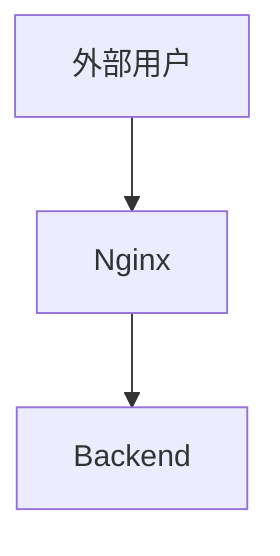
而不是：
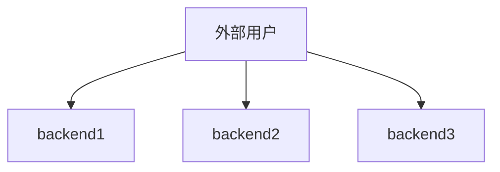
所以只需要把
```
Nginx: 80
```
映射成：
```
宿主机：8080
```
Backend 只在 Docker 内部网络通信即可。

## 十一、验证 Docker 网络
启动 Backend：
```bash
docker compose up -d backend1 backend2 backend3
```
检查：
```bash
docker compose ps
```
应该看到：
```text
backend1 up
backend2 up
backend3 up
```
查看 Docker 网络：
```bash
docker network ls
```
可以看到：
```text
nginx-cluster_default
```
查看：
```bash
docker network inspect nginx-cluster_default
```
可以看到：
```text
backend1
backend2
backend3
```
都加入了同一个网络。

## 十二、验证 Docker DNS
可以启动临时 curl 容器：
```bash
docker run --rm --network nginx-cluster_default curlimages/curl http://backend1:3000/server
```
结果：
```json
{ "server": "backend1" }
```
访问：
```bash
docker run --rm --network nginx-cluster_default curlimages/curl http://backend2:3000/server
```
结果：
```json
{ "server": "backend2" }
```
结果：
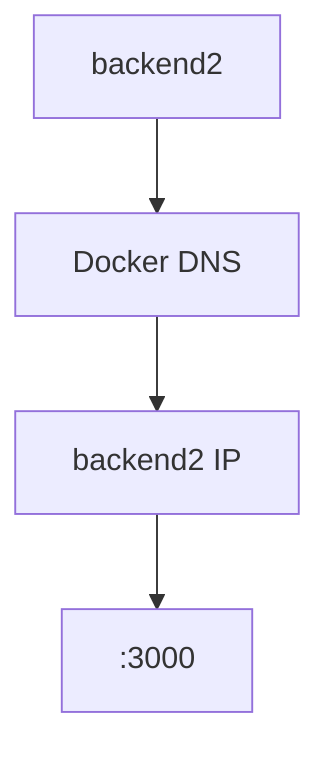

## 十三、正式配置 upstream
```nginx
upstream backend_cluster {
    server backend1:3000;
    server backend2:3000;
    server backend3:3000;
}

log_format upstream_log
    '$remote_addr - $request '
    'status=$status '
    'upstream_addr=$upstream_addr '
    'upstream_status=$upstream_status '
    'upstream_response_time=$upstream_response_time '
    'request_time=$request_time';

server {
    listen 80;
    access_log /var/log/nginx/access.log upstream_log;

    location /health {
        return 200 "nginx ok\n";
    }

    location /api/ {
        proxy_pass http://backend_cluster/;
        proxy_set_header Host $host;
        proxy_set_header X-Real-IP $remote_addr;
        proxy_set_header X-Forwarded-For $proxy_add_x_forwarded_for;
        proxy_set_header X-Forwarded-Proto $scheme;
    }
}
```
注意：
```nginx
proxy_pass http://backend_cluster/;
```
后面有 `/`。
因此：
```text
/api/server
```
进入
```text
location /api/
```
后：
```text
/api/
```
会被替换为 `/`。
最终 Backend 收到：
```text
/server
```
这一点和前面反向代理章节完全一致。

## 十四、检查 Nginx 配置
启动：
```bash
docker compose up -d nginx
```
执行：
```bash
docker compose exec nginx nginx -t
```
正常：
```text
syntax is ok
test is successful
```
注意：
```text
nginx -t 成功
```
只能说明：
```text
Nginx 配置语法和基本引用没有问题。
```
不代表业务一定正常。

继续查看最终生效配置：
```bash
docker compose exec nginx nginx -T
```
确认：
```nginx
upstream backend_cluster
```
以及：
```nginx
proxy_pass http://backend_cluster/;
```
真的存在。

## 十五、实验一：默认 Round Robin
如果 upstream 没有配置负载均衡算法：
```nginx
upstream backend_cluster {
  server backend1:3000;
  server backend2:3000;
  server backend3:3000;
}
```
Nginx 默认采用轮询。

测试：
```bash
for i in {1..9}; do
  curl -s http://localhost:8080/api/server
  echo
done
```
看到的结果为：
```json
{"server":"backend1"}
{"server":"backend2"}
{"server":"backend3"}
{"server":"backend1"}
{"server":"backend2"}
{"server":"backend3"}
{"server":"backend1"}
{"server":"backend2"}
{"server":"backend3"}
```
这就是 Round Robin。

## 十六、完整请求链路
假设当前轮询选中了 backend2：
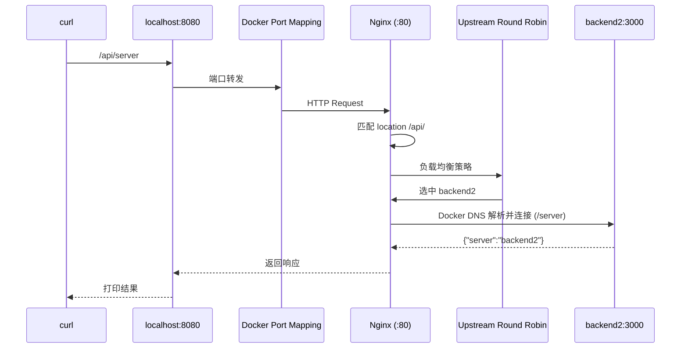
注意 upstream 负责的是：
```text
选择 backend2
```
Docker DNS 负责：
```text
backend2 → IP
```

## 十七、通过日志证明负载均衡
只看返回值还不够。

查看 Nginx 日志：
```bash
docker compose logs nginx
```
可能看到：
```log
nginx-1  | 192.168.96.1 - GET /api/server HTTP/1.1 status=200 upstream_addr=192.168.96.2:3000 upstream_status=200 upstream_response_time=0.004 request_time=0.003
```
**核心变量**：

`$upstream_addr`
代表 Nginx 实际连接的 upstream 地址。
例如：
```text
172.20.0.3:3000
```
意味着请求最后去了这个 Backend。

`$upstream_status`
Backend 返回的 HTTP 状态码。
例如：
```text
200
404
500
```

`$upstream_response_time`
Backend 响应时间。
例如：
```text
0.002
```

`$request_time`
整个请求从 Nginx 接收到完成的总耗时。
它和 `upstream_response_time` 不完全一样。

## 十八、查看 Backend 日志
执行：
```bash
docker compose logs backend1
docker compose logs backend2
docker compose logs backend3
```
可能看到：
```log
backend1 | [backend1] GET /server
backend2 | [backend2] GET /server
backend3 | [backend3] GET /server
```
现在我们有三层证据：
```text
响应结果 + Nginx $upstream_addr + Backend 日志
```
三者共同证明 Round Robin 真正发生了。

## 十九、weight 权重
默认情况下：
```nginx
server backend1:3000;
server backend2:3000;
```
可以认为权重相同。

如果配置：
```nginx
upstream backend_cluster {
    server backend1:3000 weight=3;
    server backend2:3000 weight=1;
}
```
它表达的是：
```text
backend1 权重 3
backend2 权重 1
```
理论趋势：
```text
backend1 ≈ 75%
backend2 ≈ 25%
```

## 二十、weight 不是随机概率
很多人会理解成：
> 每次请求随机抽奖，backend1 75%，backend2 25%。
这个理解不够准确。

Nginx 的加权轮询会根据权重进行调度。

对于连续请求来说，结果往往会非常接近设置的比例。

但是在真实系统里还会受到：

- Backend 故障
- 重试
- worker
- 长连接
- 请求时序

等因素影响。

所以工程上应该理解为：

> weight 描述长期请求分配比例，而不是要求每任意 4 个请求都严格是 3:1。

## 二十一、实测 weight
修改：
```nginx
upstream backend_cluster {
  server backend1:3000 weight=3;
  server backend2:3000 weight=1;
}
```
重新加载：
```bash
docker compose exec nginx nginx -t
docker compose exec nginx nginx -s reload
```
连续请求 100 次：
```bash
for i in {1..100}; do
  curl -s http://localhost:8080/api/server
  echo
done | grep -o 'backend[0-9]' | sort | uniq -c
```
可能得到：
```text
75 backend1 25 backend2
```
重点不是一定得到精确 75/25。
重点是：
```text
backend1 明显承担更多请求
```

## 二十二、weight 的真实使用场景
假设：
```text
backend1 8核16G
backend2 2核4G
```
如果两台机器平均分流 `50% 50%`，并不合理。

可以：
```nginx
upstream backend_cluster {
  server backend1:3000 weight=4;
  server backend2:3000 weight=1;
}
```
让性能更强的机器承担更多请求。

## 二十三、backup 备用服务器
配置：
```nginx
upstream backend_cluster {
  server backend1:3000;
  server backend2:3000 backup;
}
```
这里 `backend2` 不是普通负载均衡成员，而是：
> 备用服务器

正常情况下：
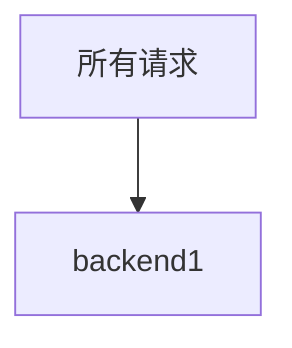
backend2 不参与普通请求分配。

## 二十四、验证 backup
连续请求：
```bash
for i in {1..10}; do
  curl -s http://localhost:8080/api/server
  echo
done
```
正常应该全部：
```text
backend1
```
backend2 基本不会收到请求。
查看：
```bash
docker compose logs backend2
```
没有对应请求。

## 二十五、停止主节点
执行：
```bash
docker compose stop backend1
```
再次：
```bash
curl http://localhost:8080/api/server
```
此时正常情况下：
```json
{"server":"backend2"}
```
说明：
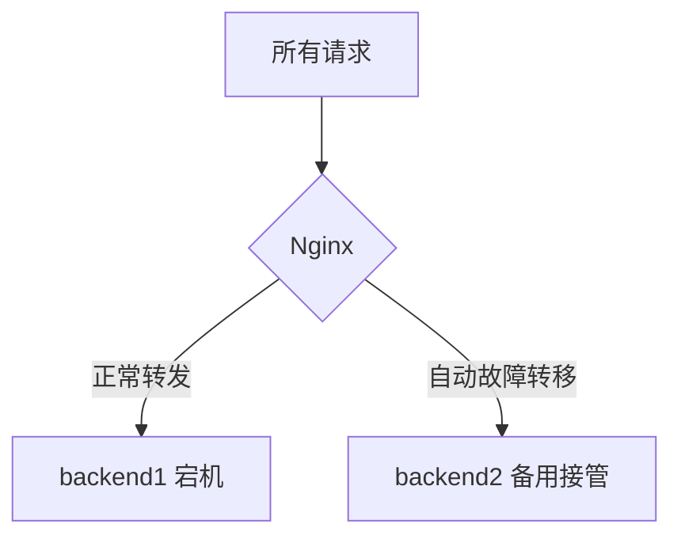

## 二十六、backup 的正确理解
不要理解成：
```text
backend1 一失败
立即永久切换到 backend2
```
它更准确的含义是：

> 当普通 upstream server 当前无法正常提供服务时，备用节点才参与。

因此 backup 非常适合：
- 冷备节点
- 备用机
- 降级实例

## 二十七、down
配置：
```nginx
upstream backend_cluster {
  server backend1:3000;
  server backend2:3000 down;
  server backend3:3000;
}
```
down 表示：
> 人工告诉 Nginx：这个节点当前不要参与负载均衡。

因此：
```text
backend1 ✅
backend2 🚫
backend3 ✅
```

## 二十八、down 和容器停止有什么区别？
这是一个非常重要的区别。

配置：
```nginx
server backend2:3000 down;
```
此时 backend2 容器仍然运行，你甚至可以：
```bash
docker run --rm \
  --network nginx-stage1-chapter4_default \
  curlimages/curl \
  http://backend2:3000/server
```
访问它。但是 Nginx 不会选择 backend2。

如果执行：
```bash
docker compose stop backend2
```
含义则完全不同：Backend 服务真的停止了。

因此：
```text
down = Nginx 调度层主动摘除
docker stop = 服务进程真实不可用了
```

## 二十九、验证 down
配置：
```nginx
upstream backend_cluster {
    server backend1:3000;
    server backend2:3000 down;
    server backend3:3000;
}
```
发送：
```bash
for i in {1..10}; do
  curl -s http://localhost:8080/api/server
  echo
done
```
应该只看到 `backend1` 和 `backend3`，没有 `backend2`。

同时 backend2 容器仍然是：
```bash
docker compose ps
# backend2 Up
```
这正好证明：容器存活 ≠ 一定参与 upstream。

## 三十、max_fails
现在进入本章最容易理解错误的一部分。
配置：
```nginx
server backend1:3000 max_fails=2 fail_timeout=10s;
```
max_fails=2 表示：
> 在 fail_timeout 指定的时间窗口内，当和该节点通信失败达到一定次数后，Nginx 会暂时认为这个节点不可用。

例如：10 秒内连续连接 backend1 失败达到 2 次，Nginx 会暂时避免继续选择它。

## 三十一、fail_timeout
```text
fail_timeout=10s
```
具有两个紧密相关的含义：
- 统计失败次数所使用的时间窗口
- 节点被认为不可用后，大致暂时屏蔽该节点的时间

千万不要理解成：
> Nginx 每 10 秒主动访问一次 Backend 的 /health。
这是错误的。

## 三十二、这不是主动健康检查
开源 Nginx 的 `max_fails + fail_timeout` 主要依赖真实业务请求过程中产生的失败。

例如：
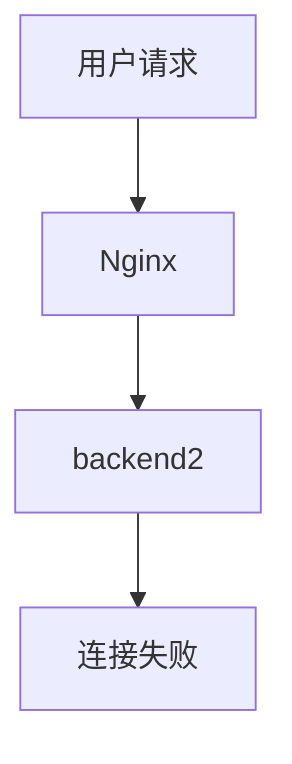
Nginx 才发现 backend2 好像不行。

所以属于**被动故障判断**，而不是 Nginx 每隔几秒主动 GET /health。这一点必须分清。

## 三十三、故障实验：停止 backend2
配置：
```nginx
upstream backend_cluster {
  server backend1:3000 max_fails=2 fail_timeout=10s;
  server backend2:3000 max_fails=2 fail_timeout=10s;
  server backend3:3000 max_fails=2 fail_timeout=10s;
}
```
停止：
```bash
docker compose stop backend2
```
连续请求：
```bash
for i in {1..20}; do
  curl -s http://localhost:8080/api/server
  echo
done
```
你通常会发现大部分请求仍然能够成功，因为 backend1 和 backend3 仍然可用。

## 三十四、失败链路是什么？
假设 Round Robin 恰好选中 backend2：
```mermaid
sequenceDiagram
    participant Client as 客户端
    participant Nginx as Nginx
    participant Upstream as backend_cluster
    participant Docker as Docker 网络
    participant Backend2 as backend2:3000

    Client->>Nginx: 发起请求
    Nginx->>Upstream: 负载均衡策略
    Upstream-->>Nginx: 选择 backend2
    Nginx->>Docker: 请求路由
    Docker->>Backend2: 尝试建立连接
    Backend2-->>Docker: 连接失败
    Docker-->>Nginx: 返回连接错误
    Nginx-->>Client: 返回 502 Bad Gateway
```
Nginx 会记录 upstream 连接失败，之后根据 `max_fails` 和 `fail_timeout` 等配置逐渐认为节点不可用，其他可用 Backend 会承担请求。

## 三十五、查看 error log
```bash
docker compose logs nginx
```
可能看到类似：
```log
connect() failed (111: Connection refused) while connecting to upstream
```
这条日志非常重要，它说明失败发生在：
```mermaid
sequenceDiagram
    participant Nginx as Nginx
    participant Backend as Backend

    Nginx->>Backend: 1. 尝试建立 TCP 连接
    Backend-->>Nginx: 2. 连接失败 (Connection Refused / Timeout)
    Note over Nginx: 3. 触发 upstream 错误处理
    Nginx-->>Nginx: 4. 记录 error_log
```
这个阶段。

不是浏览器无法连接 Nginx。

## 三十六、upstream_addr 可能记录多个地址
发生重试时，一个请求可能尝试不止一个 upstream。

例如日志可能出现类似：
```text
upstream_addr=172.20.0.3:3000, 172.20.0.4:3000
```
它表达：
```text
第一次 backend2 ❌
第二次 backend3 ✅
```
因此 `$upstream_addr` 不仅可以告诉我们最终去了哪里，还可能帮助判断是否发生了 upstream 重试或故障转移。

## 三十七、故障实验：端口写错
故意：
```nginx
upstream backend_cluster {
  server backend1:3000;
  server backend2:3001;
  server backend3:3000;
}
```
这里 backend2 实际监听 `3000`，但 Nginx 却连接 `3001`。

执行：
```bash
docker compose exec nginx nginx -t
```
大概率仍然 `successful`。为什么？

因为 `server backend2:3001;` 语法完全合法。所以 `nginx -t 成功 ≠ 业务配置正确`。

## 三十八、如何排查错误端口？
推荐顺序：

**第一步**：`docker compose ps` 确认 backend2 是否运行。

如果 backend2 是 Up，说明容器活着，但 `容器活着 ≠ 3001 正确`。

**第二步**：`docker compose logs backend2` 可以看到 `[backend2] listening on 3000`。

**第三步**：`docker compose exec nginx nginx -T` 发现 `server backend2:3001;`。

于是问题定位完成：Backend 实际 3000，Nginx 配置 3001。

## 三十九、404 和 502 的区别
负载均衡排错里必须继续保持之前建立的状态码意识。

**404**
例如 Nginx 成功代理到 backend1，Backend 返回 404 Not Found。
说明 Nginx → Backend 通信通常已经成功，只是 Backend 没有对应路由。日志可能显示 `upstream_status=404`。

**502**
如果 backend2:3000 根本连接不上，并且没有可用的其他 upstream 可以处理，Nginx 很可能返回 502 Bad Gateway。

所以：
```text
404 ≈ Backend 收到请求，但资源不存在
502 ≈ Nginx 无法从 upstream 获取正常响应
```
不要看到错误就统一认为 "Nginx 配置有问题"。

## 四十、常见负载均衡算法
除了默认 Round Robin，Nginx 还支持其他常见算法。

### 1、Round Robin
默认方式：
```nginx
upstream backend_cluster {
  server backend1:3000;
  server backend2:3000;
}
```
适合 Backend 性能相近、请求处理耗时相近的场景。

特点：简单、通用、默认推荐起点。

### 2、Weighted Round Robin
```nginx
server backend1:3000 weight=3;
server backend2:3000 weight=1;
```
适合不同 Backend 性能差异较大的场景。

### 3、least_conn
```nginx
upstream backend_cluster {
  least_conn;
  server backend1:3000;
  server backend2:3000;
  server backend3:3000;
}
```
含义：优先把新的请求交给当前活动连接较少的 Backend。

适合请求处理时间差异很大的场景。例如：
```text
backend1 当前 100 个连接
backend2 当前 20 个连接
backend3 当前 30 个连接
```
新连接更倾向 backend2。

### 4、ip_hash
```nginx
upstream backend_cluster {
    ip_hash;
    server backend1:3000;
    server backend2:3000;
}
```
Nginx 根据客户端 IP 进行哈希，让同一来源的客户端倾向落到相同 Backend。常被用于会话保持。

但不要因此形成 "ip_hash = 最佳 session 方案" 的误解。现代系统通常更推荐 Session 外置（Redis、数据库、JWT），避免 Backend 本地保存重要会话状态，否则扩容、故障切换都会更加麻烦。

## 四十一、为什么后端最好设计成无状态？
```mermaid
sequenceDiagram
    participant Client as 客户端
    participant Nginx as Nginx
    participant Backend1 as backend1
    participant Backend2 as backend2

    Note over Client, Backend1: 第一次登录
    Client->>Nginx: 1. 登录请求
    Nginx->>Backend1: 2. 转发至 backend1
    Backend1-->>Nginx: 3. 登录成功，返回 SessionID
    Note over Backend1: 4. 将 Session 保存在本地内存
    Nginx-->>Client: 5. 返回 SessionID

    Note over Client, Backend2: 第二次请求 (Session 丢失)
    Client->>Nginx: 6. 携带 SessionID 发起请求
    Nginx->>Backend2: 7. 轮询转发至 backend2
    Note over Backend2: 8. 内存中没有该 Session
    Backend2-->>Nginx: 9. 验证失败 (401 Unauthorized)
    Nginx-->>Client: 10. 提示未登录
```
于是用户突然变成未登录。这不是 Nginx 的问题，而是后端状态设计的问题。

更合理的设计是：
```mermaid
graph TD
    Backend1[backend1] --> Redis[(Redis)]
    Backend2[backend2] --> Redis
    Backend3[backend3] --> Redis
```
所有 Backend 共享状态，这样 Nginx 可以自由负载均衡。

## 四十二、depends_on 不等于服务已经可用
Compose 中 `depends_on` 主要控制容器启动顺序，并不天然保证应用已经完成初始化。

例如：
```text
backend 容器启动
  ↓
Node 还在初始化
  ↓
Nginx 已经开始请求
```
仍然可能失败。

真正生产环境要结合 healthcheck、重试、容错来考虑。

## 四十三、健康接口有什么作用？
Backend 提供 `GET /health`，例如：
```json
{
  "status": "ok",
  "server": "backend1"
}
```
它可以用于：人工排查、容器 healthcheck、外部监控、负载均衡器检测。

但要注意：我们配置一个 /health 路由，不代表开源 Nginx 就会自动定期访问它。这是两个完全不同的概念。

## 四十四、生产环境常见完整配置
```nginx
upstream backend_cluster {
    server backend1:3000 weight=3 max_fails=3 fail_timeout=10s;
    server backend2:3000 weight=2 max_fails=3 fail_timeout=10s;
    server backend3:3000 max_fails=3 fail_timeout=10s;
}

log_format upstream_log
    '$remote_addr [$time_local] '
    '"$request" '
    'status=$status '
    'request_time=$request_time '
    'upstream_addr=$upstream_addr '
    'upstream_status=$upstream_status '
    'upstream_response_time=$upstream_response_time';

server {
    listen 80;
    access_log /var/log/nginx/access.log upstream_log;

    location /health {
        default_type text/plain;
        return 200 "nginx ok\n";
    }

    location /api/ {
        proxy_pass http://backend_cluster/;
        proxy_set_header Host $host;
        proxy_set_header X-Real-IP $remote_addr;
        proxy_set_header X-Forwarded-For $proxy_add_x_forwarded_for;
        proxy_set_header X-Forwarded-Proto $scheme;
    }
}
```

## 四十五、负载均衡排错标准流程
遇到问题以后，不要直接修改配置。应该按链路逐层定位。

### 第一步：请求有没有进入 Nginx？
```bash
curl -i http://localhost:8080/api/server
```
同时：
```bash
docker compose logs nginx
```
如果完全没有访问日志：
```mermaid
graph TD
    A[客户端] --> B[Nginx]
```
检查：Docker port mapping、宿主机端口、Nginx 是否运行。

### 第二步：命中了哪个 location？
查看：
```bash
docker compose exec nginx nginx -T
```
确认 `location /api/ {}` 以及其他 location 是否抢先匹配。

### 第三步：proxy_pass 指向谁？
查看 `proxy_pass http://backend_cluster/;`，确定对应 `upstream backend_cluster`。

### 第四步：upstream 中有哪些节点？
```nginx
upstream backend_cluster {
    server backend1:3000;
    server backend2:3000;
}
```
检查：服务名、端口、weight、backup、down、max_fails、fail_timeout。

### 第五步：容器是否运行？
```bash
docker compose ps
```
但是一定要记住：`Up` 只能说明容器进程存在，不能证明端口正确、网络正确、应用正常。

### 第六步：网络是否正确？
```bash
docker network inspect nginx-stage1-chapter4_default
```
确认 nginx、backend1、backend2、backend3 在同一个 Docker 网络。

### 第七步：Docker DNS 是否能够解析？
可以从同一网络启动临时容器：
```bash
docker run --rm \
  --network nginx-stage1-chapter4_default \
  curlimages/curl \
  http://backend1:3000/server
```
如果显示 `Could not resolve host`，重点检查：服务名、Docker 网络。

### 第八步：Backend 到底监听哪个端口？
```bash
docker compose logs backend1
```
例如可以看到 `listening on 3000`，然后对照 `server backend1:3000;`。

### 第九步：Nginx 实际选择了谁？
看 `$upstream_addr`，例如 `172.20.0.3:3000`。

### 第十步：Backend 返回了什么？
看 `$upstream_status`，例如 `200`、`404`、`500`。

## 四十六、几个命令分别解决什么问题？

| 命令 | 回答 |
|------|------|
| `docker compose ps` | 哪些容器正在运行？ |
| `docker network inspect` | 哪些容器加入了这个网络？ |
| `docker logs backend1` | Backend 有没有启动？有没有收到请求？监听哪个端口？ |
| `docker logs nginx` | Nginx 有没有收到请求？连接 upstream 是否出错？ |
| `nginx -t` | Nginx 配置语法是否可加载？ |
| `nginx -T` | Nginx 最终实际使用的完整配置是什么？ |
| `curl -i` | HTTP 状态码、响应头、响应体是什么？ |
| `curl -v` | 更详细的连接和 HTTP 请求过程是什么？ |

## 四十七、本章完整心智模型
脑子里应该自动出现这样的完整请求链路：
```mermaid
sequenceDiagram
    participant Client as 客户端
    participant Host as localhost:8080
    participant Docker as Docker Port Mapping
    participant Nginx as Nginx (:80)
    participant Upstream as backend_cluster
    participant DNS as Docker DNS
    participant Backend as backend2:3000

    Client->>Host: 发起请求
    Host->>Docker: 端口转发
    Docker->>Nginx: 接收请求
    Nginx->>Nginx: 匹配 server & location /api/
    Nginx->>Upstream: 触发负载均衡算法
    Upstream-->>Nginx: 选中 backend2
    Nginx->>DNS: 解析 backend2 容器 IP
    DNS-->>Nginx: 返回 IP 地址
    Nginx->>Backend: 建立 TCP :3000 连接
    Backend-->>Nginx: 返回 HTTP Response
    Nginx-->>Host: 返回响应
    Host-->>Client: 展示结果
```

如果 backend2 出问题：
```mermaid
sequenceDiagram
    participant Nginx as Nginx
    participant Backend2 as backend2
    participant Other as 其他 Backend

    Nginx->>Backend2: 尝试建立连接
    Backend2-->>Nginx: 连接失败 (Connection Refused)
    Note over Nginx: 记录 error_log
    Note over Nginx: 失败次数 +1
    alt 失败次数 < max_fails
        Nginx->>Other: 尝试转发给其他节点
    else 失败次数 >= max_fails
        Note over Nginx: 标记 backend2 为不可用
        Note over Nginx: 暂停转发 (fail_timeout 期间)
        Nginx->>Other: 强制转发给其他健康节点
    end
```