如果只有一台后端服务器，Nginx 的反向代理非常简单：
```
location /api/ { 
  proxy_pass http://backend:3000; 
}
```
请求链路就是：
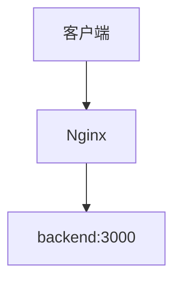
但真实生产环境通常不会只有一个后端实例。

可能是：
- backend1
- backend2
- backend3

这时就出现了新的问题：
> 一个请求到达 Nginx 后，到底应该交给哪一个 Backend？

这就是 **Nginx upstream 和负载均衡** 要解决的问题。

## 一、先理解什么是负载均衡
假设我们的系统只有一个 Backend：`backend1`，客户端 → Nginx → :3000
如果大量请求全部进入 backend1：
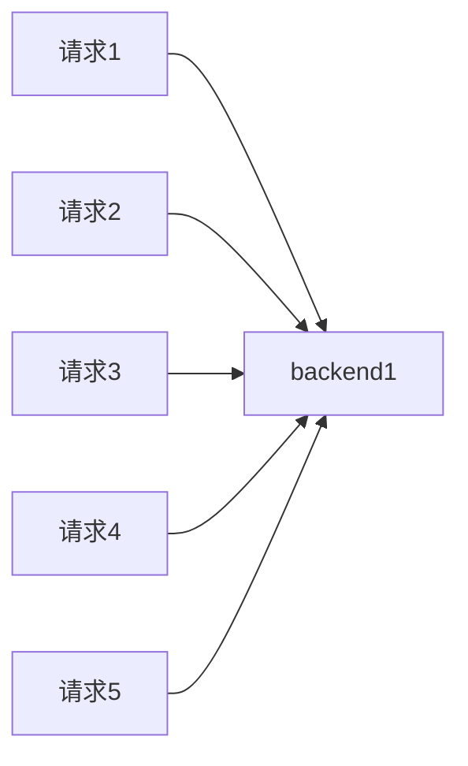
backend1 的压力会越来越大。

如果增加三个实例：
```Mermaid 
graph LR
    Client[客户端] --> Nginx[Nginx]
    Nginx --> B1[backend1]
    Nginx --> B2[backend2]
    Nginx --> B3[backend3]
```
Nginx 就可以把请求分散出去：
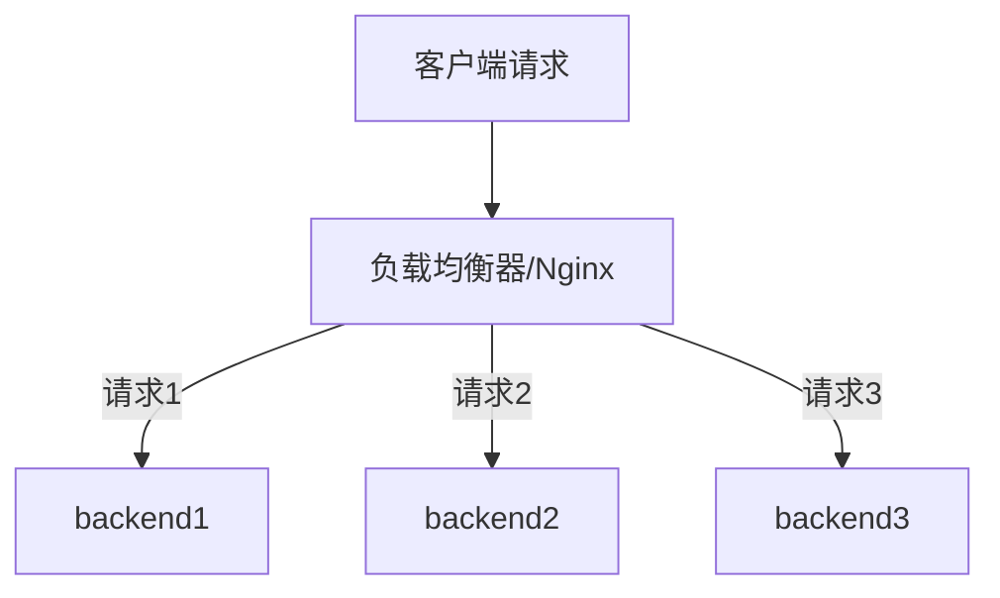
这就是最基础的负载均衡。

负载均衡主要解决三件事情：
- **请求分摊**
- **服务扩展**
- **一定程度的故障容忍**

不过这里必须先纠正一个常见误区：
> 有负载均衡，不代表系统就一定高可用。

例如三个 Backend 全部运行在同一台物理服务器：
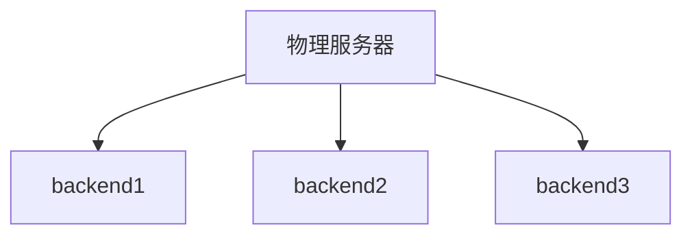
如果这台服务器断电，三个 Backend 会一起挂掉。

所以：**负载均衡 ≠ 完整高可用**

## 二、upstream 是什么？
Nginx 可以通过 upstream 定义一组后端服务器：
```Nginx
upstream backend_cluster { 
  server backend1:3000; 
  server backend2:3000; 
  server backend3:3000; 
}
```
然后：
```
location /api/ { 
  proxy_pass http://backend_cluster; 
}
```
完整链路变成：
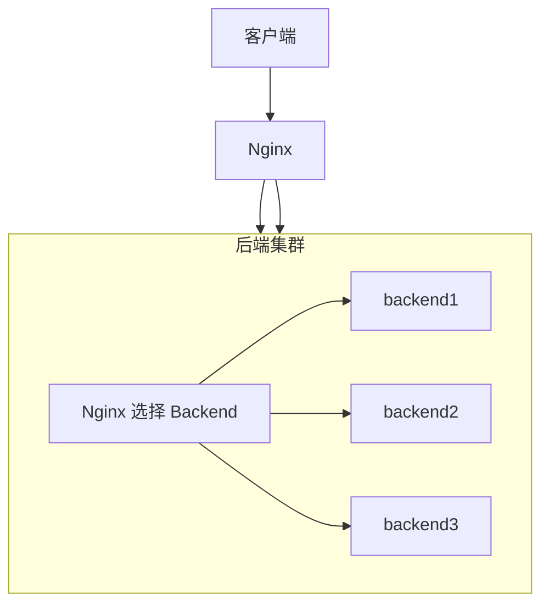
这里最重要的是分清两个名字：
`backend_cluster` 和 `backend1` 完全不是一回事。

### 2.1 backend_cluster 是什么？
```
upstream backend_cluster {}
```
这里的：
```
backend_cluster
```
只是 **Nginx 自己定义的 upstream 逻辑组名**。

你完全可以改成：
```
upstream user_servers {}
```
然后：
```
proxy_pass http://user_servers;
```
它：
- 不是 Docker 容器名。
- 不是 Compose Service Name。
- 不是 DNS 域名。
- 不是服务器 IP。

它只是：
> Nginx 对一组 Backend 起的名字。

### 2.2 backend1 是什么？
```
server backend1:3000;
```
这里的：
```
backend1
```
必须能够真正解析到某一个 Backend 地址。

在我们的 Docker Compose 环境中：
```
backend1 
backend2 
backend3
```
都是 Compose Service Name，同时可以通过 Docker DNS 解析。

因此：
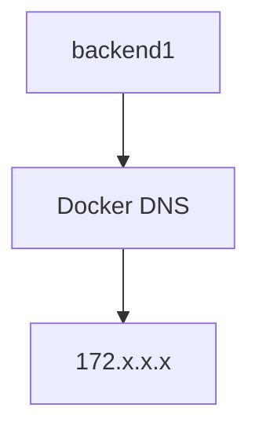

## 三、upstream 和 Docker DNS 的关系
这是学习 Docker + Nginx 时非常容易混淆的地方。

一句话记住：
> upstream 负责选谁，Docker DNS 负责找到谁。

例如：
```
upstream backend_cluster { 
  server backend1:3000; 
  server backend2:3000; 
  server backend3:3000; 
}
```
假设 Nginx 这次选择：
```
backend2:3000
```
接下来：
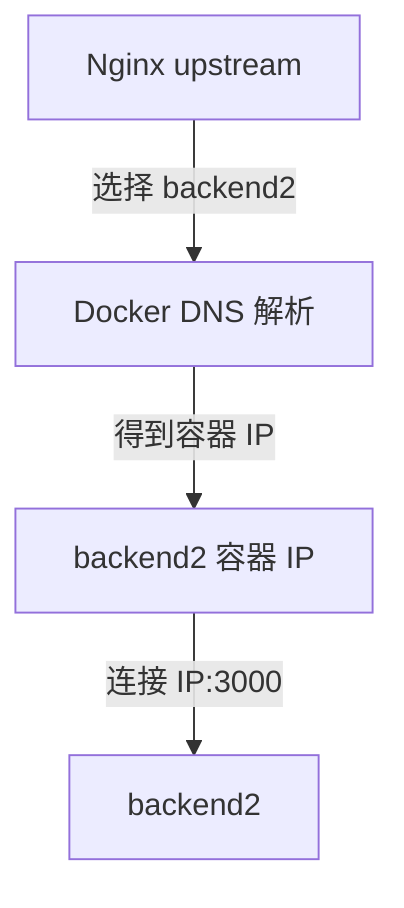
所以二者职责不同：
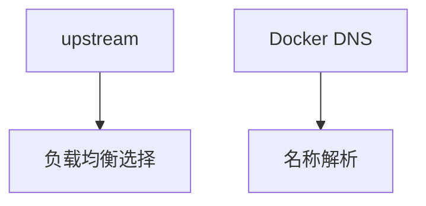

## 四、为什么不用容器 IP？
假设 Docker 当前分配：
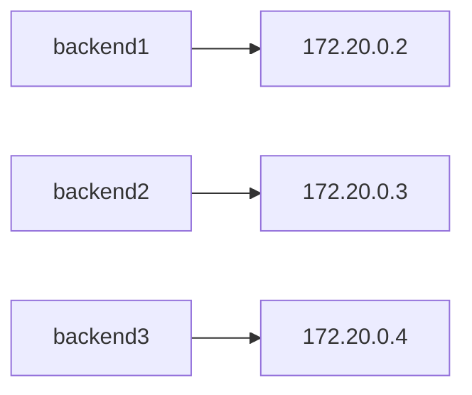
如果我们直接配置：
```
server 172.20.0.3:3000;
```
问题是：

backend2 被删除并重新创建后：
```
backend2 → 172.20.0.8
```
旧配置：
```
172.20.0.3
```
就失效了。

所以 Docker 环境中通常使用：
```
server backend2:3000;
```
而不是固定容器 IP。

名称比容器 IP 更稳定。

## 五、实验项目架构
我们搭建：
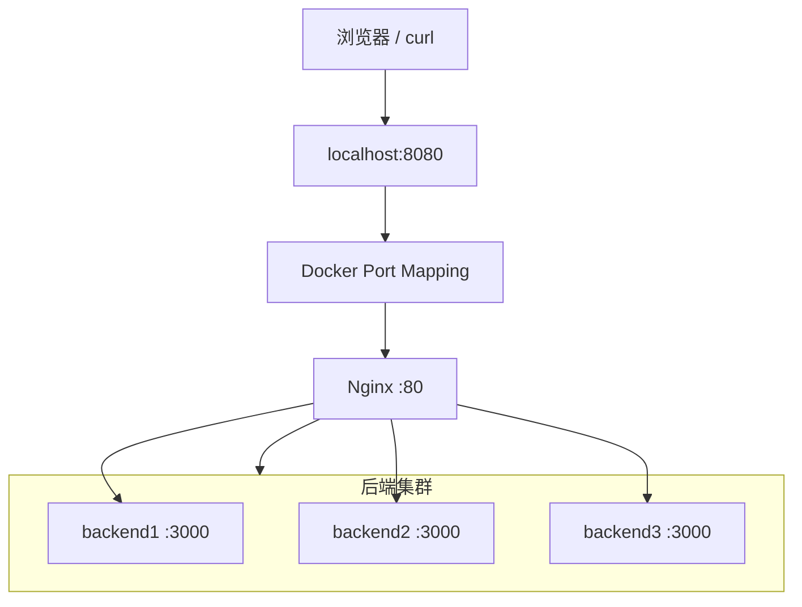
项目目录：
```
nginx-stage1-chapter4/ 
├── docker-compose.yml 
├── nginx/ 
│ └── conf.d/ 
│ └── default.conf 
└── backend/ 
  ├── Dockerfile 
  └── server.js
```

## 六、创建 Backend
创建：
```
backend/server.js
```
内容：
```js
const http = require('http');

// 从环境变量中读取服务名称，默认为 'unknown'
const PORT = 3000;
const SERVER_NAME = process.env.SERVER_NAME || 'unknown';

const server = http.createServer((req, res) => {
  // 打印请求日志
  console.log(
    `[${SERVER_NAME}] ${req.method} ${req.url} from ${req.socket.remoteAddress}`
  );

  // 设置统一的响应头
  res.setHeader('Content-Type', 'application/json; charset=utf-8');

  // 路由: /server - 返回当前服务器名称
  if (req.url === '/server') {
    res.end(JSON.stringify({ server: SERVER_NAME }));
    return;
  }

  // 路由: /health - 健康检查接口
  if (req.url === '/health') {
    res.end(JSON.stringify({ status: 'ok', server: SERVER_NAME }));
    return;
  }

  // 路由: /request-info - 返回请求的详细信息
  if (req.url === '/request-info') {
    res.end(
      JSON.stringify({
        server: SERVER_NAME,
        method: req.method,
        url: req.url,
        host: req.headers.host,
        xRealIp: req.headers['x-real-ip'],
        xForwardedFor: req.headers['x-forwarded-for'],
        xForwardedProto: req.headers['x-forwarded-proto'],
      })
    );
    return;
  }

  // 兜底: 404 Not Found
  res.statusCode = 404;
  res.end(
    JSON.stringify({
      error: 'Not Found',
      server: SERVER_NAME,
    })
  );
});

// 监听 0.0.0.0 允许外部访问（在 Docker 中非常重要）
server.listen(PORT, '0.0.0.0', () => {
  console.log(`[${SERVER_NAME}] listening on ${PORT}`);
});
```
这里使用：
```
process.env.SERVER_NAME
```
区分不同 Backend。

虽然三个容器使用完全相同的镜像，但是：
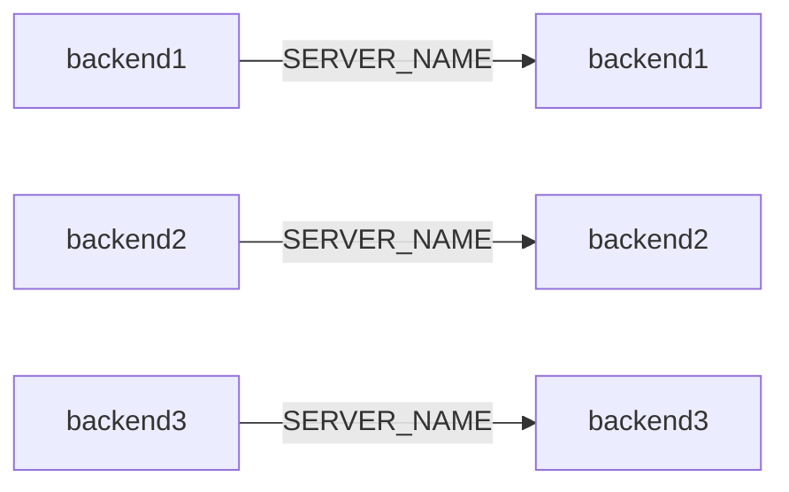
因此访问：
```
/server
```
就可以知道请求最终落在哪个 Backend。

## 七、创建 Backend 镜像
创建：`backend/Dockerfile`
```
FROM node:22-alpine 

WORKDIR /app 

COPY server.js . 

EXPOSE 3000 CMD ["node", "server.js"]
```
构建：
```
docker build -t nginx-cluster:1.0 ./backend
```
检查：
```
docker images | grep nginx-cluster
```

## 八、Docker 中三个 Backend 为什么都能监听 3000？
这是理解整个实验的基础。

三个容器：
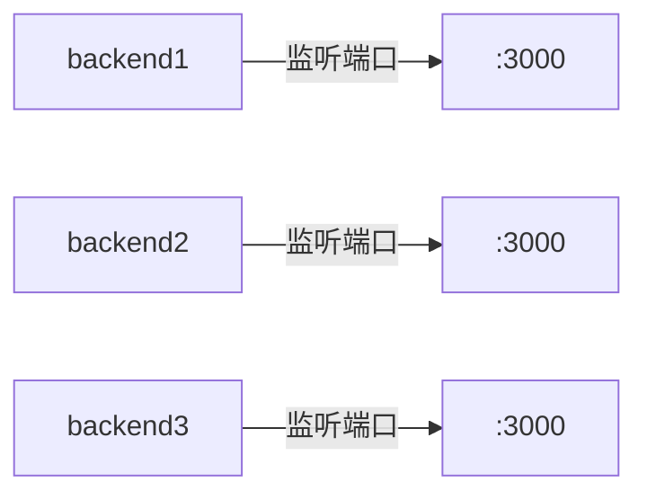
不会发生端口冲突。

因为每个容器都有自己的网络空间。

可以简单理解成：
```
172.20.0.2:3000 
172.20.0.3:3000 
172.20.0.4:3000
```
IP 不同，因此端口可以相同。

真正会冲突的是：
```
ports: 
  - "3000:3000"
```
如果三个容器都这样配置：
```
宿主机:3000 → backend1:3000 
宿主机:3000 → backend2:3000 
宿主机:3000 → backend3:3000
```
宿主机只有一个 3000，自然会发生端口冲突。

## 九、创建 Docker Compose
