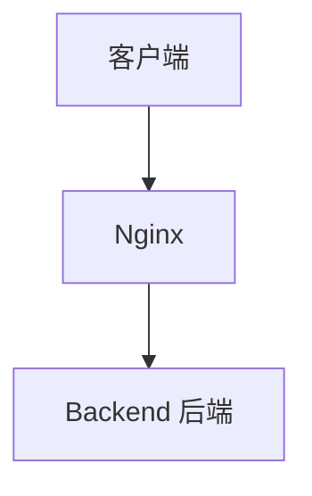
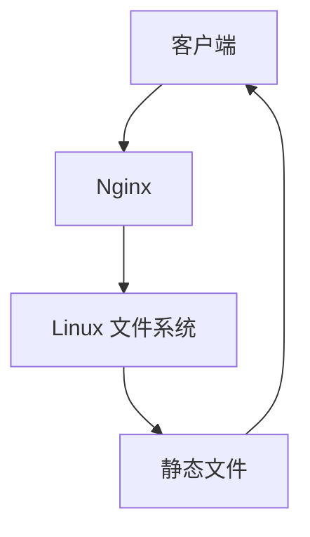
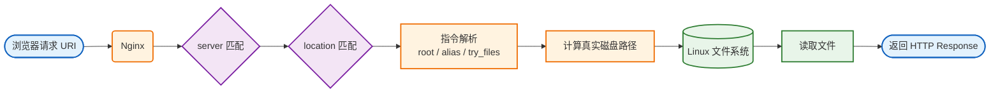
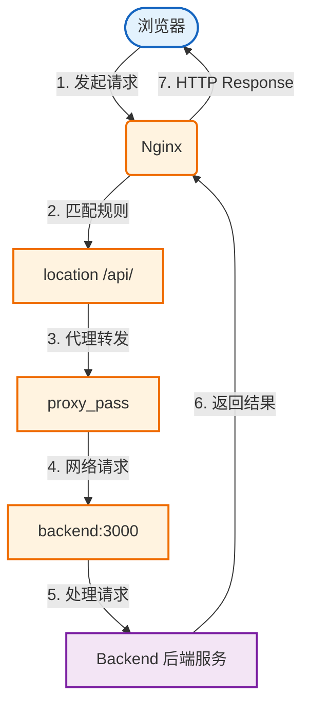
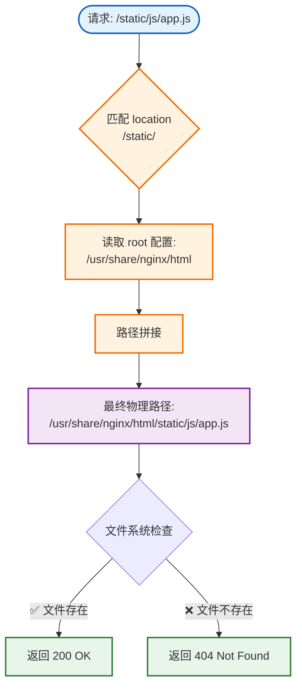

这一章，Nginx 的角色会发生一个很重要的变化。

之前它更多是：



而处理前端项目时，很多请求根本不需要 Backend。

例如：

```
/index.html
/assets/index.js 
/assets/index.css 
/logo.png
```

这些文件本来就已经存在于服务器磁盘中。

因此更合理的链路是：



---

这一章我们要彻底解决几个实际开发中非常常见的问题：

- Nginx 到底怎么根据 URI 找文件？
- `root` 和 `alias` 到底有什么区别？
- 为什么 Vue / React 刷新页面会 404？
- `try_files` 到底做了什么？
- 为什么 JS/CSS 可以缓存一年，但 index.html 不应该？
- 200、304、disk cache 到底有什么区别？
- 静态资源 404 和后端接口 404 怎么区分？

---

## 一、Nginx 是如何把 URI 映射成磁盘文件的？

先建立这一章最重要的模型：



例如浏览器请求：

```http
GET /static/js/app.js
```

这里的 `/static/js/app.js` 只是 **URI**，它并不是 Linux 磁盘路径。

真正的文件可能位于：

- `/usr/share/nginx/html/static/js/app.js`
- `/data/assets/js/app.js`
- `/var/www/frontend/dist/js/app.js`

Nginx 需要根据配置，把 URI 转换为 Linux 文件路径。因此可以先把静态资源处理理解为：

```
URI + Nginx 路径配置 = 真实文件路径
```

---

## 二、静态文件与 proxy_pass 有什么本质区别？

### 静态文件配置

```nginx
location /static/ { 
    root /usr/share/nginx/html; 
}
```

访问 `/static/js/app.js`，Nginx 自己读取 `/usr/share/nginx/html/static/js/app.js`，请求链路：


这里没有 Backend。

### 代理转发配置

```nginx
location /api/ { 
    proxy_pass http://backend:3000/; 
}
```

访问 `/api/users`，链路变成：



> **重要提醒**：以后遇到 404，第一个判断应该是：这个请求到底是**静态资源**还是**代理转发**。否则很容易排错方向完全错误。

---

## 三、为什么 Nginx 适合处理静态资源？

### Node.js 返回 JS


### Nginx 直接提供


明显少了一层应用服务器。Nginx 本身就非常擅长：

- 高并发连接
- 静态文件读取
- sendfile
- 缓存控制
- 连接复用
- 事件驱动 IO

### 生产环境典型架构


这也是为什么 Vue、React 项目经常：

```bash
npm run build
```

以后得到一个 dist 目录，然后直接交给 Nginx。

---

## 四、root：最重要的路径推导规则

```nginx
location /static/ {
    root /usr/share/nginx/html;
}
```

请求：`/static/js/app.js`

对于 `root`，先建立这个公式：

```
真实文件路径 ≈ root + 完整 URI
```

因此：

- **root**：`/usr/share/nginx/html`
- **URI**：`/static/js/app.js`
- **得到**：`/usr/share/nginx/html/static/js/app.js`

于是 Nginx 会尝试读取 `/usr/share/nginx/html/static/js/app.js`。

---

## 五、不要误以为 location 会自动删除 URI

这是初学 `root` 最容易犯的错误。

**错误理解**：

```
配置：location /static/ + root /usr/share/nginx/html
请求：/static/js/app.js

有人会认为 /static/ 已经被 location 匹配了，
因此剩下 js/app.js，
然后 Nginx 去 /usr/share/nginx/html/js/app.js
```

**这是错的！**

对于 `root`：

```
/usr/share/nginx/html + /static/js/app.js = /usr/share/nginx/html/static/js/app.js
```

`/static/` 依然属于完整 URI，并不会被 location "吃掉"。这也是后面理解 `alias` 的关键。

---

## 六、root 实战

### 项目结构

```
nginx-stage1-chapter5/ 
├── docker-compose.yml 
├── nginx/ 
│   └── conf.d/ 
│       └── default.conf 
└── html/ 
    └── static/ 
        └── js/ 
            └── app.js
```

### app.js

```javascript
console.log("hello nginx");
```

### docker-compose.yml

```yaml
services:
  nginx:
    image: nginx:latest
    container_name: nginx-chapter5
    ports:
      - "8080:80"
    volumes:
      - ./nginx/conf.d/default.conf:/etc/nginx/conf.d/default.conf:ro
      - ./html:/usr/share/nginx/html:ro
```

### Nginx 配置

```nginx
server {
    listen 80;

    location /static/ {
        root /usr/share/nginx/html;
    }
}
```

### 启动验证

```bash
# 启动容器
docker compose up -d

# 检查状态
docker compose ps

# 请求测试
curl -i http://localhost:8080/static/js/app.js
# 应该返回 HTTP/1.1 200 OK
```

路径计算流程：



---

## 七、Docker Volume 与 Nginx root 是两回事

这是很容易混淆的一点。

### Docker Volume 映射

```
宿主机目录 ./html  →  容器目录 /usr/share/nginx/html
./html/static/js/app.js  →  /usr/share/nginx/html/static/js/app.js
```

### Nginx 根据 root 处理 URI

```
浏览器 URI: /static/js/app.js
       ↓
Nginx root: /usr/share/nginx/html/static/js/app.js
       ↓
Docker volume 映射到:
       ↓
宿主机: ./html/static/js/app.js
```

> **注意**：不要把 Docker volume mapping 和 Nginx URI mapping 混为一谈。

---

## 八、故障实验：root 写错为什么会 404？

### 错误配置

```nginx
location /static/ {
    root /data;  # 错误：应该是完整路径
}
```

### 语法检查

```bash
docker exec nginx-chapter5 nginx -t
# 可能依然显示：syntax is ok, test is successful
```

> **重要**：语法检查成功 ≠ 业务配置正确！

### 请求计算

```
/data + /static/js/app.js = /data/static/js/app.js
```

文件不存在，于是返回 404。

### 查看日志

```bash
docker logs nginx-chapter5
# 可能看到：open() "/data/static/js/app.js" failed
```

> **这条日志非常重要！** 以后看到 `open() "xxxxx" failed`，你就知道这是 Nginx 实际计算出的磁盘文件路径。

---

## 九、alias：它和 root 到底有什么区别？

**场景**：真实文件在 `/data/assets/js/app.js`，但希望 URL 是 `/static/js/app.js`。

如果写：

```nginx
location /static/ {
    root /data/assets;
}
```

根据 `root + URI` 得到 `/data/assets/static/js/app.js`，但实际文件是 `/data/assets/js/app.js`，显然多了一层 `/static`。

此时 `alias` 就派上用场了。

---

## 十、alias 的核心思想

```nginx
location /static/ {
    alias /data/assets/;
}
```

请求：`/static/js/app.js`

`alias` 的思路不是 `alias + 完整 URI`，而是：

```
/static/js/app.js
       ↓
去掉 /static/  →  /js/app.js
       ↓
替换成 /data/assets/  →  /data/assets/js/app.js
```

这正好就是目标文件。

---

## 十一、什么时候用 root？什么时候用 alias？

### 使用 root 的场景

URL 路径和磁盘目录结构基本一致，例如：

```
root /usr/share/nginx/html;

# 目录结构：
/usr/share/nginx/html/
├── index.html
└── assets/
    ├── index.js
    └── index.css
```

### 使用 alias 的场景

URL 路径和真实目录结构不一致，需要替换，例如：

```nginx
# URL: /downloads/a.zip
# 实际: /data/files/a.zip
location /downloads/ {
    alias /data/files/;
}
```

**总结**：

| 指令 | 适用场景 |
|------|----------|
| `root` | URI 和磁盘目录结构基本一致 |
| `alias` | URL 路径和真实目录结构不一致，需要替换 |

---

## 十二、index 是什么？

```nginx
root /usr/share/nginx/html;
index index.html;
```

### 为什么 Nginx 能返回 index.html？

访问 `/`，根据 `root + URI` 得到 `/usr/share/nginx/html/`，注意这是目录不是文件。

配置 `index index.html;` 相当于告诉 Nginx：当请求映射到一个目录时，默认尝试寻找 `index.html`。

于是进一步尝试 `/usr/share/nginx/html/index.html`，最终返回内容。

### 访问 / 和 /index.html 有什么区别？

| 请求 | 过程 |
|------|------|
| `/index.html` | 直接找文件 `/usr/share/nginx/html/index.html` |
| `/` | 找目录 → 根据 `index` 找默认首页 |

```
/index.html  →  直接找文件
/            →  找目录 → 根据 index 找默认首页
```

最终内容可能一样，但过程不完全一样。

---

## 十三、进入本章重点：try_files

```nginx
location / { 
    try_files $uri $uri/ =404; 
}
```

> 核心含义：按顺序尝试不同目标，只要找到就使用，全部失败就走最后一个兜底。

### $uri 是什么？

请求 `/user/avatar.png`，`$uri` 就是规范化后的 URI `/user/avatar.png`。

如果配置 `root /usr/share/nginx/html;`，那么 `try_files $uri ...` 实际上会检查 `/usr/share/nginx/html/user/avatar.png`。

> **注意**：try_files 里的 `$uri` 会结合当前 `root` / `alias` 来检查真实文件，不是直接检查网页 URL。

### $uri/ 是什么？

请求 `/docs`：

- `$uri` 相当于检查 `/docs`
- `$uri/` 相当于尝试 `/docs/`（对应磁盘目录）

### try_files 执行逻辑

```nginx
try_files $uri $uri/ =404;
```

| 步骤 | 检查内容 | 成功时 |
|------|----------|--------|
| 第一步 | `$uri` - 看看有没有对应文件 | 返回文件 |
| 第二步 | `$uri/` - 看看有没有对应目录 | 进入目录处理 |
| 第三步 | `=404` - 都没有就返回 404 | 返回 404 |

---

## 十四、为什么 SPA 刷新页面会 404？

### 问题背景

假设 Vue Router 有这些路由：

```
/
/about
/user/123
```

但是打包后真正的服务器文件可能只有：

```
dist/ 
├── index.html 
└── assets/ 
    ├── index-abc123.js 
    └── index-def456.css
```

> **注意**：磁盘上根本没有 `about`、`user/123` 这些路径，这些只是前端 Router 定义的逻辑路由。

### 从首页跳转为什么正常？

第一次访问 `/`，Nginx 返回 `index.html`，JavaScript 被加载，Vue Router 接管浏览器路由。点击 `/about` 时，很多情况下浏览器只是执行 `history.pushState()`，并没有真的重新请求 `GET /about`，所以页面正常。

### 为什么刷新 /about 就失败？

刷新 `http://localhost:8080/about`，浏览器真的发送 `GET /about`，Nginx 根据 `root /usr/share/nginx/html` 去找 `/usr/share/nginx/html/about`，但是磁盘上根本没有这个文件，于是返回 **404**。

这就是所谓的 **SPA 刷新 404**。

---

## 十五、try_files 如何解决 SPA 404？

### 配置方案

```nginx
location / {
    try_files $uri $uri/ /index.html;
}
```

### 执行流程

访问 `/user/123`：

| 步骤 | 检查项 | 实际路径 | 结果 |
|------|--------|----------|------|
| 1 | `$uri` | `/usr/share/nginx/html/user/123` | 不存在，继续 |
| 2 | `$uri/` | `/usr/share/nginx/html/user/123/` | 不存在，继续 |
| 3 | `/index.html` | `/usr/share/nginx/html/index.html` | 存在，返回 |

Nginx 内部转到 `/index.html`，返回给浏览器。浏览器加载 Vue / React JS，然后前端 Router 看到当前 URL `/user/123`，于是渲染用户详情页。

### 完整链路


> **注意**：Nginx 并不知道什么是 Vue Router。它只是发现文件不存在，然后按照配置返回 `/index.html`。真正决定 `/user/123` 显示哪个组件的是前端 Router。
