这一章，Nginx 的角色会发生一个很重要的变化。

之前它更多是：

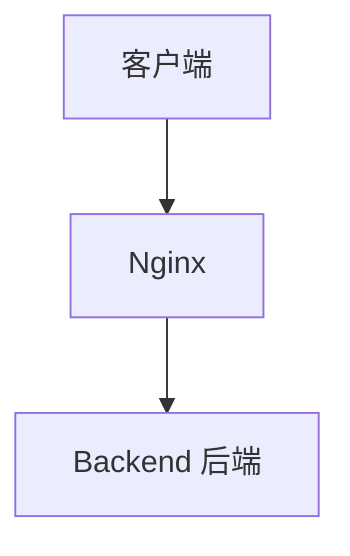

而处理前端项目时，很多请求根本不需要 Backend。

例如：

```
/index.html
/assets/index.js 
/assets/index.css 
/logo.png
```

这些文件本来就已经存在于服务器磁盘中。

因此更合理的链路是：

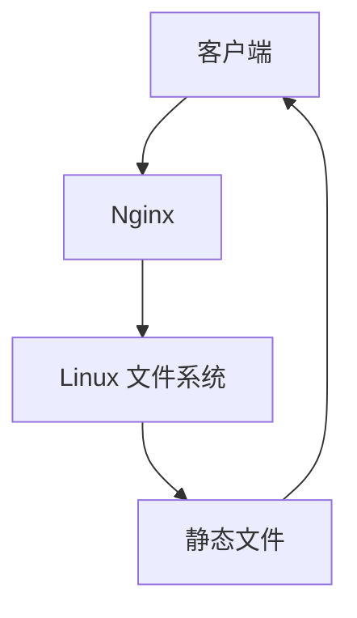

---

这一章我们要彻底解决几个实际开发中非常常见的问题：

- Nginx 到底怎么根据 URI 找文件？
- `root` 和 `alias` 到底有什么区别？
- 为什么 Vue / React 刷新页面会 404？
- `try_files` 到底做了什么？
- 为什么 JS/CSS 可以缓存一年，但 index.html 不应该？
- 200、304、disk cache 到底有什么区别？
- 静态资源 404 和后端接口 404 怎么区分？

---

## 一、Nginx 是如何把 URI 映射成磁盘文件的？

先建立这一章最重要的模型：


例如浏览器请求：

```http
GET /static/js/app.js
```

这里的 `/static/js/app.js` 只是 **URI**，它并不是 Linux 磁盘路径。

真正的文件可能位于：

- `/usr/share/nginx/html/static/js/app.js`
- `/data/assets/js/app.js`
- `/var/www/frontend/dist/js/app.js`

Nginx 需要根据配置，把 URI 转换为 Linux 文件路径。因此可以先把静态资源处理理解为：

```
URI + Nginx 路径配置 = 真实文件路径
```

---

## 二、静态文件与 proxy_pass 有什么本质区别？

### 静态文件配置

```nginx
location /static/ { 
    root /usr/share/nginx/html; 
}
```

访问 `/static/js/app.js`，Nginx 自己读取 `/usr/share/nginx/html/static/js/app.js`，请求链路：

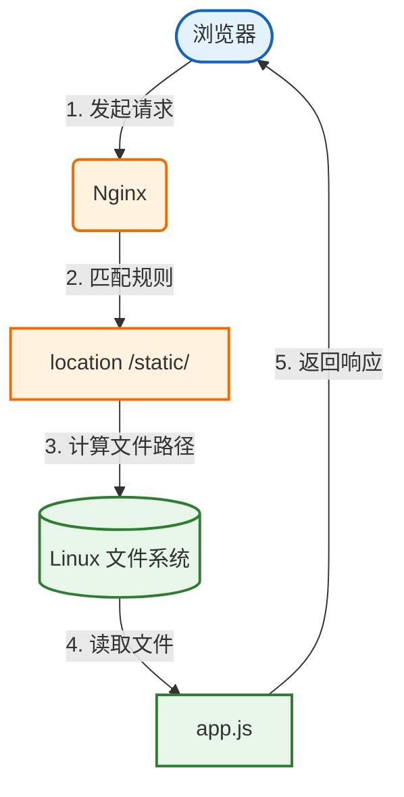

这里没有 Backend。

### 代理转发配置

```nginx
location /api/ { 
    proxy_pass http://backend:3000/; 
}
```

访问 `/api/users`，链路变成：


> **重要提醒**：以后遇到 404，第一个判断应该是：这个请求到底是**静态资源**还是**代理转发**。否则很容易排错方向完全错误。

---

## 三、为什么 Nginx 适合处理静态资源？

### Node.js 返回 JS

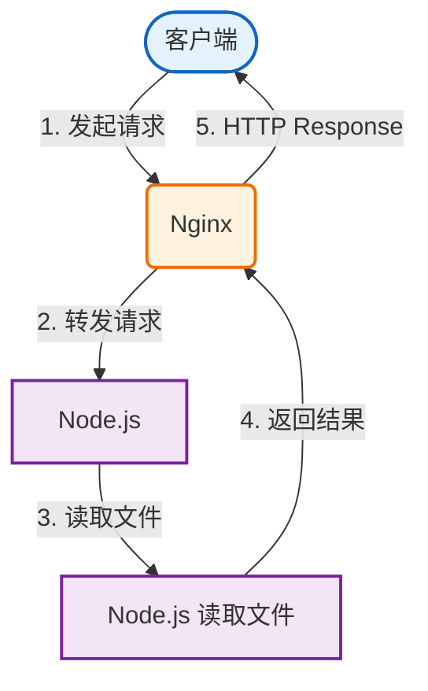

### Nginx 直接提供

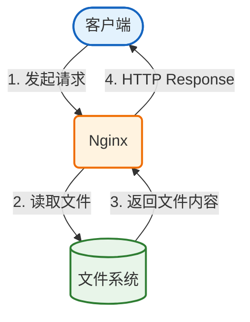

明显少了一层应用服务器。Nginx 本身就非常擅长：

- 高并发连接
- 静态文件读取
- sendfile
- 缓存控制
- 连接复用
- 事件驱动 IO

### 生产环境典型架构

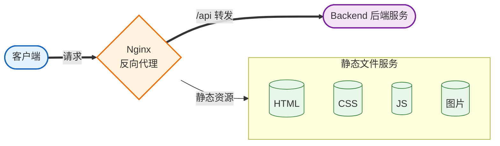

这也是为什么 Vue、React 项目经常：

```bash
npm run build
```

以后得到一个 dist 目录，然后直接交给 Nginx。

---

## 四、root：最重要的路径推导规则

```nginx
location /static/ {
    root /usr/share/nginx/html;
}
```

请求：`/static/js/app.js`

对于 `root`，先建立这个公式：

```
真实文件路径 ≈ root + 完整 URI
```

因此：

- **root**：`/usr/share/nginx/html`
- **URI**：`/static/js/app.js`
- **得到**：`/usr/share/nginx/html/static/js/app.js`

于是 Nginx 会尝试读取 `/usr/share/nginx/html/static/js/app.js`。

---

## 五、不要误以为 location 会自动删除 URI

这是初学 `root` 最容易犯的错误。

**错误理解**：

```
配置：location /static/ + root /usr/share/nginx/html
请求：/static/js/app.js

有人会认为 /static/ 已经被 location 匹配了，
因此剩下 js/app.js，
然后 Nginx 去 /usr/share/nginx/html/js/app.js
```

**这是错的！**

对于 `root`：

```
/usr/share/nginx/html + /static/js/app.js = /usr/share/nginx/html/static/js/app.js
```

`/static/` 依然属于完整 URI，并不会被 location "吃掉"。这也是后面理解 `alias` 的关键。

---

## 六、root 实战

### 项目结构

```
nginx-stage1-chapter5/ 
├── docker-compose.yml 
├── nginx/ 
│   └── conf.d/ 
│       └── default.conf 
└── html/ 
    └── static/ 
        └── js/ 
            └── app.js
```

### app.js

```javascript
console.log("hello nginx");
```

### docker-compose.yml

```yaml
services:
  nginx:
    image: nginx:latest
    container_name: nginx-chapter5
    ports:
      - "8080:80"
    volumes:
      - ./nginx/conf.d/default.conf:/etc/nginx/conf.d/default.conf:ro
      - ./html:/usr/share/nginx/html:ro
```

### Nginx 配置

```nginx
server {
    listen 80;

    location /static/ {
        root /usr/share/nginx/html;
    }
}
```

### 启动验证

```bash
# 启动容器
docker compose up -d

# 检查状态
docker compose ps

# 请求测试
curl -i http://localhost:8080/static/js/app.js
# 应该返回 HTTP/1.1 200 OK
```

路径计算流程：


---

## 七、Docker Volume 与 Nginx root 是两回事

这是很容易混淆的一点。

### Docker Volume 映射

```
宿主机目录 ./html  →  容器目录 /usr/share/nginx/html
./html/static/js/app.js  →  /usr/share/nginx/html/static/js/app.js
```

### Nginx 根据 root 处理 URI

```
浏览器 URI: /static/js/app.js
       ↓
Nginx root: /usr/share/nginx/html/static/js/app.js
       ↓
Docker volume 映射到:
       ↓
宿主机: ./html/static/js/app.js
```

> **注意**：不要把 Docker volume mapping 和 Nginx URI mapping 混为一谈。

---

## 八、故障实验：root 写错为什么会 404？

### 错误配置

```nginx
location /static/ {
    root /data;  # 错误：应该是完整路径
}
```

### 语法检查

```bash
docker exec nginx-chapter5 nginx -t
# 可能依然显示：syntax is ok, test is successful
```

> **重要**：语法检查成功 ≠ 业务配置正确！

### 请求计算

```
/data + /static/js/app.js = /data/static/js/app.js
```

文件不存在，于是返回 404。

### 查看日志

```bash
docker logs nginx-chapter5
# 可能看到：open() "/data/static/js/app.js" failed
```

> **这条日志非常重要！** 以后看到 `open() "xxxxx" failed`，你就知道这是 Nginx 实际计算出的磁盘文件路径。

---

## 九、alias：它和 root 到底有什么区别？

**场景**：真实文件在 `/data/assets/js/app.js`，但希望 URL 是 `/static/js/app.js`。

如果写：

```nginx
location /static/ {
    root /data/assets;
}
```

根据 `root + URI` 得到 `/data/assets/static/js/app.js`，但实际文件是 `/data/assets/js/app.js`，显然多了一层 `/static`。

此时 `alias` 就派上用场了。

---

## 十、alias 的核心思想

```nginx
location /static/ {
    alias /data/assets/;
}
```

请求：`/static/js/app.js`

`alias` 的思路不是 `alias + 完整 URI`，而是：

```
/static/js/app.js
       ↓
去掉 /static/  →  /js/app.js
       ↓
替换成 /data/assets/  →  /data/assets/js/app.js
```

这正好就是目标文件。

---

## 十一、什么时候用 root？什么时候用 alias？

### 使用 root 的场景

URL 路径和磁盘目录结构基本一致，例如：

```
root /usr/share/nginx/html;

# 目录结构：
/usr/share/nginx/html/
├── index.html
└── assets/
    ├── index.js
    └── index.css
```

### 使用 alias 的场景

URL 路径和真实目录结构不一致，需要替换，例如：

```nginx
# URL: /downloads/a.zip
# 实际: /data/files/a.zip
location /downloads/ {
    alias /data/files/;
}
```

**总结**：

| 指令 | 适用场景 |
|------|----------|
| `root` | URI 和磁盘目录结构基本一致 |
| `alias` | URL 路径和真实目录结构不一致，需要替换 |

---

## 十二、index 是什么？

```nginx
root /usr/share/nginx/html;
index index.html;
```

### 为什么 Nginx 能返回 index.html？

访问 `/`，根据 `root + URI` 得到 `/usr/share/nginx/html/`，注意这是目录不是文件。

配置 `index index.html;` 相当于告诉 Nginx：当请求映射到一个目录时，默认尝试寻找 `index.html`。

于是进一步尝试 `/usr/share/nginx/html/index.html`，最终返回内容。

### 访问 / 和 /index.html 有什么区别？

| 请求 | 过程 |
|------|------|
| `/index.html` | 直接找文件 `/usr/share/nginx/html/index.html` |
| `/` | 找目录 → 根据 `index` 找默认首页 |

```
/index.html  →  直接找文件
/            →  找目录 → 根据 index 找默认首页
```

最终内容可能一样，但过程不完全一样。

---

## 十三、进入本章重点：try_files

```nginx
location / { 
    try_files $uri $uri/ =404; 
}
```

> 核心含义：按顺序尝试不同目标，只要找到就使用，全部失败就走最后一个兜底。

### $uri 是什么？

请求 `/user/avatar.png`，`$uri` 就是规范化后的 URI `/user/avatar.png`。

如果配置 `root /usr/share/nginx/html;`，那么 `try_files $uri ...` 实际上会检查 `/usr/share/nginx/html/user/avatar.png`。

> **注意**：try_files 里的 `$uri` 会结合当前 `root` / `alias` 来检查真实文件，不是直接检查网页 URL。

### $uri/ 是什么？

请求 `/docs`：

- `$uri` 相当于检查 `/docs`
- `$uri/` 相当于尝试 `/docs/`（对应磁盘目录）

### try_files 执行逻辑

```nginx
try_files $uri $uri/ =404;
```

| 步骤 | 检查内容 | 成功时 |
|------|----------|--------|
| 第一步 | `$uri` - 看看有没有对应文件 | 返回文件 |
| 第二步 | `$uri/` - 看看有没有对应目录 | 进入目录处理 |
| 第三步 | `=404` - 都没有就返回 404 | 返回 404 |

---

## 十四、为什么 SPA 刷新页面会 404？

### 问题背景

假设 Vue Router 有这些路由：

```
/
/about
/user/123
```

但是打包后真正的服务器文件可能只有：

```
dist/ 
├── index.html 
└── assets/ 
    ├── index-abc123.js 
    └── index-def456.css
```

> **注意**：磁盘上根本没有 `about`、`user/123` 这些路径，这些只是前端 Router 定义的逻辑路由。

### 从首页跳转为什么正常？

第一次访问 `/`，Nginx 返回 `index.html`，JavaScript 被加载，Vue Router 接管浏览器路由。点击 `/about` 时，很多情况下浏览器只是执行 `history.pushState()`，并没有真的重新请求 `GET /about`，所以页面正常。

### 为什么刷新 /about 就失败？

刷新 `http://localhost:8080/about`，浏览器真的发送 `GET /about`，Nginx 根据 `root /usr/share/nginx/html` 去找 `/usr/share/nginx/html/about`，但是磁盘上根本没有这个文件，于是返回 **404**。

这就是所谓的 **SPA 刷新 404**。

---

## 十五、try_files 如何解决 SPA 404？

### 配置方案

```nginx
location / {
    try_files $uri $uri/ /index.html;
}
```

### 执行流程

访问 `/user/123`：

| 步骤 | 检查项 | 实际路径 | 结果 |
|------|--------|----------|------|
| 1 | `$uri` | `/usr/share/nginx/html/user/123` | 不存在，继续 |
| 2 | `$uri/` | `/usr/share/nginx/html/user/123/` | 不存在，继续 |
| 3 | `/index.html` | `/usr/share/nginx/html/index.html` | 存在，返回 |

Nginx 内部转到 `/index.html`，返回给浏览器。浏览器加载 Vue / React JS，然后前端 Router 看到当前 URL `/user/123`，于是渲染用户详情页。

### 完整链路

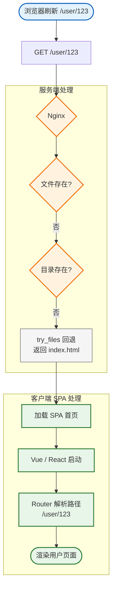

> **注意**：Nginx 并不知道什么是 Vue Router。它只是发现文件不存在，然后按照配置返回 `/index.html`。真正决定 `/user/123` 显示哪个组件的是前端 Router。

## 十六、SPA 故障实验

先故意不使用 SPA fallback：

```nginx
location / {
    try_files $uri $uri/ =404;
}
```

访问前端路由：

```bash
curl -i http://localhost:8080/user/123
```

预期结果：

```text
HTTP/1.1 404 Not Found
```

原因很直接：磁盘上不存在 `/user/123` 这个文件或目录。

然后改为：

```nginx
location / {
    try_files $uri $uri/ /index.html;
}
```

再次访问：

```bash
curl -i http://localhost:8080/user/123
```

预期返回 `200`，并且响应体实际来自 `index.html`。这说明 Nginx 完成了服务端回退，后续路由解析交给前端 Router。

## 十七、现在开始完整 SPA 项目

假设 Vue / React 打包结果如下：

```text
frontend/
└── dist/
    ├── index.html
    └── assets/
        ├── index-a83d28.js
        └── index-d93911.css
```

如果使用 Vite，执行：

```bash
npm run build
```

通常会生成 `dist/` 目录。

对于 Nginx 来说，框架并不重要。它最终看到的只是：

- HTML
- CSS
- JavaScript
- 图片
- 字体

## 十八、完整 Docker 项目结构

```text
nginx-stage1-chapter5/
├── docker-compose.yml
├── nginx/
│   └── conf.d/
│       └── default.conf
├── frontend/
│   └── dist/
│       ├── index.html
│       └── assets/
│           ├── index-a83d28.js
│           └── index-d93911.css
└── backend/
    ├── Dockerfile
    ├── package.json
    └── server.js
```

## 十九、Backend

`backend/server.js`：

```javascript
const http = require("http");

const server = http.createServer((req, res) => {
  console.log(`[backend] ${req.method} ${req.url}`);

  if (req.url === "/users") {
    res.writeHead(200, { "Content-Type": "application/json" });
    res.end(JSON.stringify({ message: "users from backend" }));
    return;
  }

  res.writeHead(404, { "Content-Type": "application/json" });
  res.end(JSON.stringify({ message: "backend 404" }));
});

server.listen(3000, "0.0.0.0", () => {
  console.log("backend listening on 3000");
});
```

`backend/package.json`：

```json
{
  "name": "nginx-backend",
  "version": "1.0.0",
  "scripts": {
    "start": "node server.js"
  }
}
```

`backend/Dockerfile`：

```dockerfile
FROM node:22-alpine

WORKDIR /app

COPY package.json .
COPY server.js .

CMD ["npm", "start"]
```

Backend 不需要暴露 `3000:3000`，因为它只需要被 Docker 网络中的 Nginx 访问。

## 二十、docker-compose.yml

```yaml
services:
  nginx:
    image: nginx:latest
    container_name: nginx-chapter5
    ports:
      - "8080:80"
    volumes:
      - ./nginx/conf.d/default.conf:/etc/nginx/conf.d/default.conf:ro
      - ./frontend/dist:/usr/share/nginx/html:ro
    depends_on:
      - backend

  backend:
    build:
      context: ./backend
    container_name: nginx-chapter5-backend
```

此时有两条通信链路：

| 通信对象 | 访问方式 | 说明 |
| --- | --- | --- |
| 宿主机访问 Nginx | `localhost:8080` → Nginx 容器 `80` | 通过 `ports` 暴露 |
| Nginx 访问 Backend | `backend:3000` | 只存在于 Docker 网络内部 |

## 二十一、不要马上写最终配置

先从最简单的静态文件配置开始：

```nginx
server {
    listen 80;

    root /usr/share/nginx/html;
    index index.html;
}
```

启动：

```bash
docker compose up -d --build
```

测试：

```bash
curl -i http://localhost:8080/
```

流程：

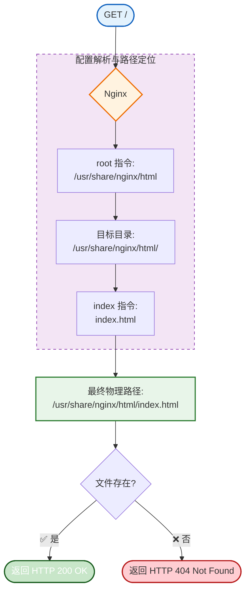

## 二十二、加入 health

增加健康检查接口：

```nginx
location /health {
    return 200 "nginx ok\n";
}
```

访问：

```bash
curl -i http://localhost:8080/health
```

预期响应：

```text
nginx ok
```

这里不存在文件读取，也不存在 Backend 调用。`return 200` 会由 Nginx 直接生成响应。

链路：

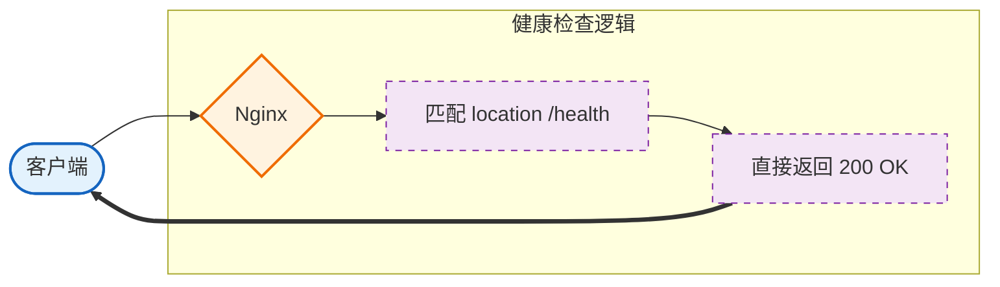

## 二十三、加入 API

先定义 `upstream`：

```nginx
upstream backend_cluster {
    server backend:3000;
}
```

再添加 API 转发：

```nginx
location /api/ {
    proxy_pass http://backend_cluster/;
}
```

访问：

```bash
curl -i http://localhost:8080/api/users
```

由于 `proxy_pass http://backend_cluster/;` 末尾有 `/`，所以 URI 会这样转换：

```text
/api/users
  ↓
/users
```

Backend 最终收到的是 `/users`。这部分你前面已经学过。

完整链路：

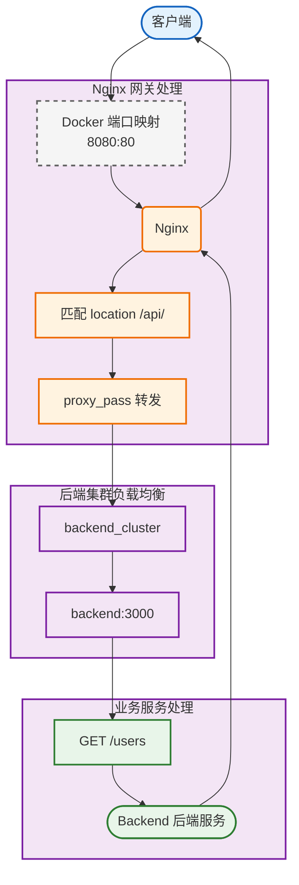

## 二十四、加入 SPA fallback

配置：

```nginx
location / {
    try_files $uri $uri/ /index.html;
}
```

效果：

| 请求 | 结果 |
| --- | --- |
| `/` | 正常访问首页 |
| `/about` | 刷新也能访问 |
| `/user/123` | 刷新也能访问 |

原因是不存在的前端 Router 地址都会回退到 `/index.html`。

## 二十五、静态资源应该单独配置

前端构建结果通常包含：

```text
/assets/index-a83d28.js
/assets/index-d93911.css
```

可以为真实静态资源单独添加配置：

```nginx
location /assets/ {
    try_files $uri =404;
}
```

这里最后不要写 `/index.html`。

如果 `/assets/not-found.js` 不存在，我们真正想要的是 `404`，而不是返回 `index.html`。否则浏览器本来想要 JavaScript：

```http
GET /assets/not-found.js
```

结果服务器却返回 HTML，可能导致：

```text
MIME type error
Unexpected token <
```

可以把规则记成：

| 请求类型 | 不存在时应该返回 |
| --- | --- |
| 页面路由 | fallback 到 `index.html` |
| 真实静态文件 | 明确返回 `404` |

## 二十六、完整请求优先级

当前结构可以整理为：

```nginx
location /health {
    ...
}

location /assets/ {
    ...
}

location /api/ {
    ...
}

location / {
    ...
}
```

不同请求的命中结果：

| 请求 | 命中的 location |
| --- | --- |
| `/assets/app.js` | `/assets/` |
| `/api/users` | `/api/` |
| `/user/123` | `/` |

所以 SPA fallback 不会影响 `/api/` 和 `/assets/`。

## 二十七、现在进入浏览器缓存

假设浏览器每次访问网站都重新下载：

- `2 MB` JavaScript
- `500 KB` CSS
- 几十张图片
- 字体文件

即使文件一年都没变化，也每次重新下载，明显会浪费：

- 带宽
- 服务器 IO
- 用户时间
- 网络延迟

于是浏览器引入了 HTTP Cache。核心可以分成两类：

| 缓存类型 | 关键区别 |
| --- | --- |
| 强缓存 | 缓存未过期时，不需要问服务器 |
| 协商缓存 | 需要问服务器缓存还能不能继续用 |

## 二十八、什么是强缓存？

强缓存的核心意思是：缓存还没过期时，浏览器甚至不需要向服务器询问。

主要响应头：

```http
Cache-Control
Expires
```

例如：

```http
Cache-Control: max-age=2592000
```

表示资源可以缓存 `2592000` 秒，也就是 `30` 天。

在有效期内：

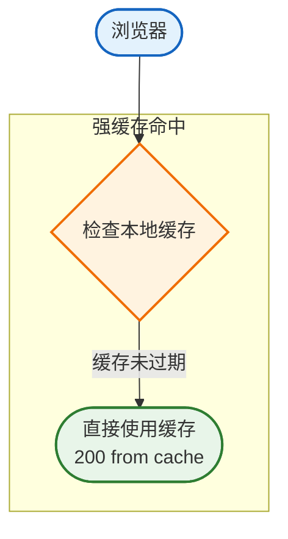

通常不会向 Nginx 发请求。

## 二十九、expires 30d 做了什么？

Nginx 配置：

```nginx
location /assets/ {
    expires 30d;
}
```

Nginx 会帮你添加类似下面的响应头：

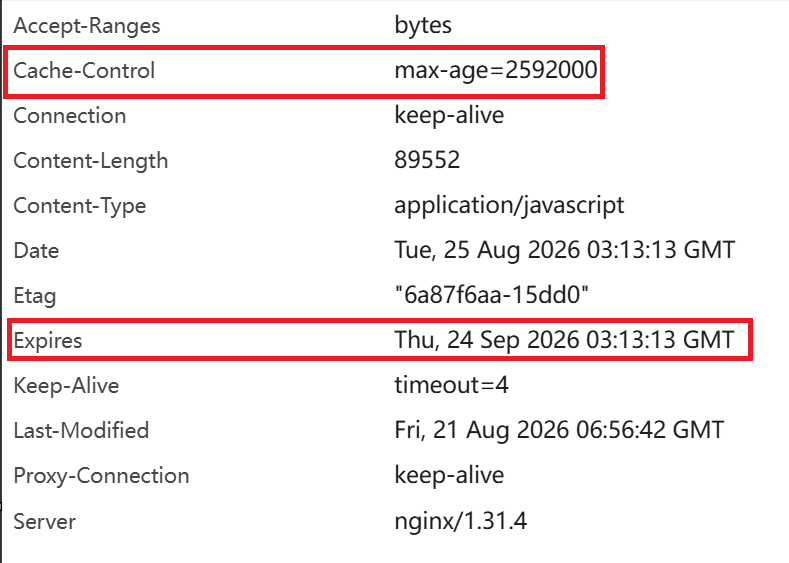

## 三十、Cache-Control 和 Expires 有什么区别？

| 响应头 | 时间类型 | 示例 | 含义 |
| --- | --- | --- | --- |
| `Expires` | 绝对时间 | `Expires: Sat, 19 Sep 2026 10:00:00 GMT` | 到这个时间以后缓存过期 |
| `Cache-Control` | 相对时间 | `Cache-Control: max-age=2592000` | 从响应产生开始，可以缓存 `2592000` 秒 |

现代浏览器通常优先使用 `Cache-Control`，所以实际项目更应该关注它。

## 三十一、200 from disk cache 是什么意思？

如果浏览器 DevTools 出现：

```text
200
(from disk cache)
```

这通常意味着浏览器根本没有真正请求 Nginx，而是直接读取自己的磁盘缓存：

```text
浏览器
  ↓
本地磁盘缓存
  ↓
直接读取资源
```

所以它和真正服务器返回的 `HTTP 200` 不是一个概念。这是强缓存命中的典型表现之一。

## 三十二、什么是协商缓存？

协商缓存不一样。它的逻辑是：

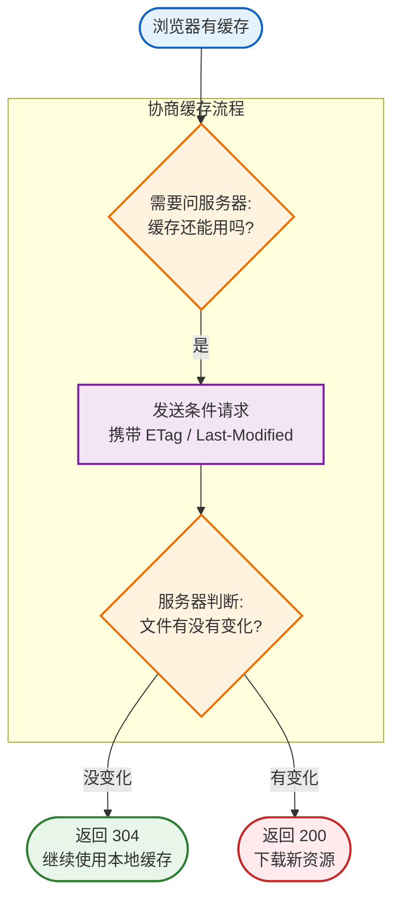

## 三十三、协商缓存的两组机制

主要有两组：

| 响应头 | 下一次请求头 | 判断依据 |
| --- | --- | --- |
| `ETag` | `If-None-Match` | 资源版本标识是否一致 |
| `Last-Modified` | `If-Modified-Since` | 文件最后修改时间是否变化 |

### Last-Modified

第一次请求：

```bash
curl -I http://localhost:8080/assets/index-a83d28.js
```

响应头中会返回：

```http
Last-Modified: Thu, 20 Aug 2026 08:00:00 GMT
```

意思是：这个文件最后修改时间是 `Thu, 20 Aug 2026 08:00:00 GMT`。

下一次浏览器可以发送：

```http
If-Modified-Since: Thu, 20 Aug 2026 08:00:00 GMT
```

服务器比较：

```text
文件从这个时间之后有没有变化？
```

如果没变化，就返回：

```http
HTTP/1.1 304 Not Modified
```

### ETag

`ETag` 可以理解为当前资源版本的标识。

第一次请求还可能看到：

```http
ETag: "68a6d320-1234"
```

浏览器下一次请求时会携带：

```http
If-None-Match: "68a6d320-1234"
```

服务器检查当前 `ETag` 是否仍然相同：

| 判断结果 | 返回 |
| --- | --- |
| 相同 | `304 Not Modified` |
| 不同 | `200` + 新文件 |

## 三十四、实际验证 304

先请求一次资源：

```bash
curl -I http://localhost:8080/assets/index-a83d28.js
```

假设返回：

```http
ETag: "abc123"
```

然后发送条件请求：

```bash
curl -i \
  -H 'If-None-Match: "abc123"' \
  http://localhost:8080/assets/index-a83d28.js
```

如果文件没变：

```http
HTTP/1.1 304 Not Modified
```

响应体通常为空。这意味着服务器认为你手里的版本就是最新的，不用再下载一遍。

## 三十五、Last-Modified 也可以验证

假设第一次响应中有：

```http
Last-Modified: Thu, 20 Aug 2026 08:00:00 GMT
```

发送：

```bash
curl -i \
  -H 'If-Modified-Since: Thu, 20 Aug 2026 08:00:00 GMT' \
  http://localhost:8080/assets/index-a83d28.js
```

如果没改：

```http
HTTP/1.1 304 Not Modified
```

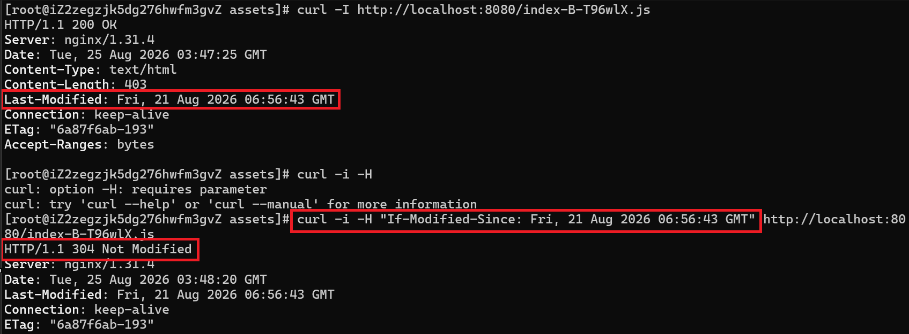

## 三十六、200、304、disk cache 到底有什么区别？

必须彻底区分这三个概念。

### 1. 200 OK

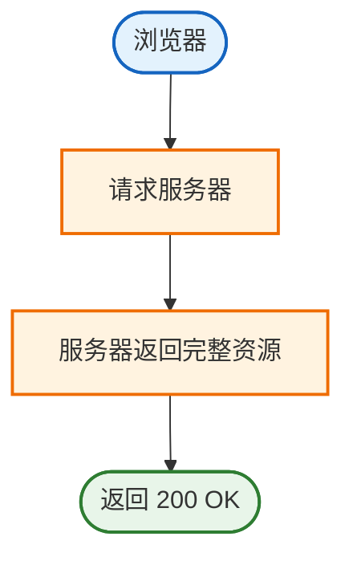

有真实网络请求，并且服务器返回完整文件。

### 2. 304 Not Modified

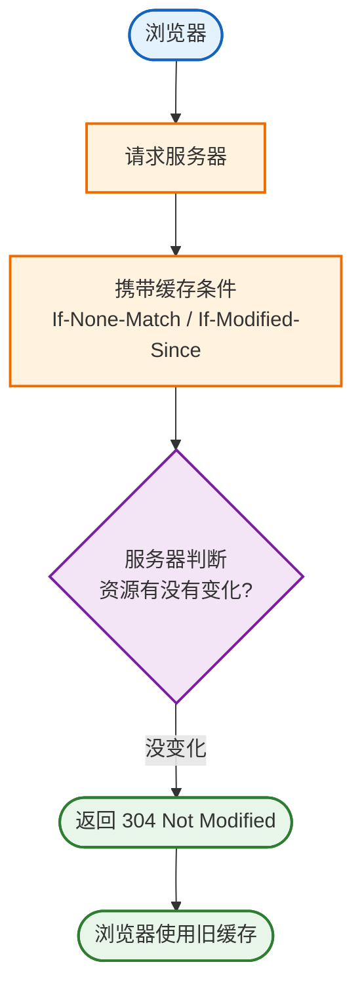

有网络请求，但是服务器通常不重新传完整资源。

### 3. from disk cache

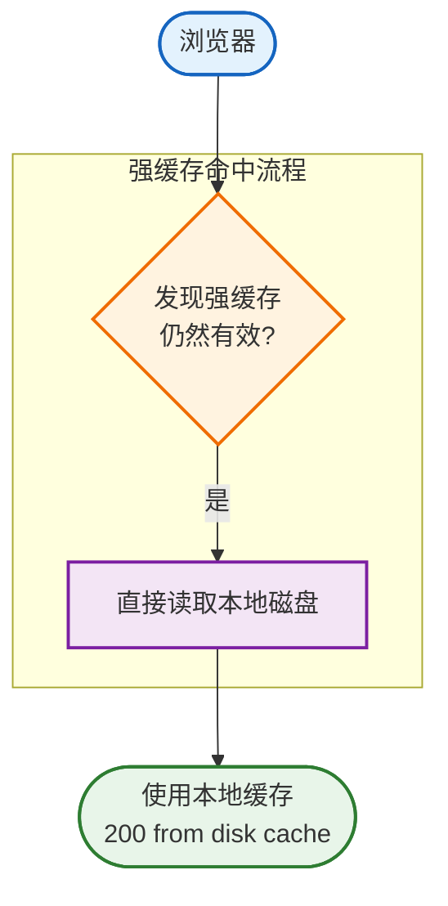

通常甚至没有请求 Nginx。

可以总结为：

| 表现 | 是否请求服务器 | 是否下载完整资源 |
| --- | --- | --- |
| `200 OK` | 是 | 是 |
| `304 Not Modified` | 是 | 否，继续用本地缓存 |
| `from disk cache` / `from memory cache` | 否 | 否，直接读本地缓存 |

## 三十七、为什么前端构建文件带 hash？

Vite 经常生成：

```text
index-a83d28.js
```

Webpack 可能：

```text
app.82ad038a.js
```

这些 `a83d28`、`82ad038a` 通常和构建内容有关。

假设第一次构建产物是：

```text
app.a83d28.js
```

修改代码重新构建以后变成：

```text
app.f39182.js
```

完整过程是：

```text
文件内容变化
  ↓
hash 变化
  ↓
文件名变化
  ↓
浏览器认为这是一个全新的 URL
  ↓
下载新文件
```

## 三十八、为什么带 hash 的文件适合长期缓存？

假设资源路径是：

```text
/assets/app.a83d28.js
```

配置：

```http
Cache-Control: max-age=31536000
```

表示缓存一年。

一个月后代码改了，重新构建后变成：

```text
/assets/app.928ac1.js
```

因为 URL 已经从 `app.a83d28.js` 变成 `app.928ac1.js`，浏览器不会错误使用旧文件。

所以：

```text
带内容 hash 的资源 + 长期缓存 = 成熟的生产方案
```

## 三十九、为什么 index.html 不能缓存一年？

假设 `index.html` 引用：

```html
<script src="/assets/app.a83d28.js"></script>
```

你发布新版本后，`index.html` 变成：

```html
<script src="/assets/app.928ac1.js"></script>
```

但如果 `index.html` 被浏览器缓存一年，用户可能还在使用旧的 `index.html`，于是依然请求：

```text
app.a83d28.js
```

它不会知道新版本已经变成：

```text
app.928ac1.js
```

因此，HTML 是新版本资源的入口，必须允许浏览器比较及时地获取最新版本。

## 四十、生产缓存策略

通常策略如下：

| 资源 | 推荐策略 | 原因 |
| --- | --- | --- |
| `index.html` | 不长期强缓存 | 它会指向最新的 hash 资源 |
| `/assets/` 下的 hash 文件 | 长期缓存 | 内容变化后文件名会变化 |

`index.html` 可以这样配置：

```nginx
location = /index.html {
    add_header Cache-Control "no-cache";
}
```

注意：`no-cache` 不是完全不允许缓存。它更接近于：

> 可以缓存，但使用缓存前需要向服务器重新验证。

如果希望完全不存，才使用：

```http
no-store
```

但 SPA 部署中经常使用 `no-cache` 就足够。

`/assets/` 可以这样配置：

```nginx
location /assets/ {
    expires 1y;
    add_header Cache-Control "public, immutable";
}
```

`immutable` 是在告诉浏览器：这个 URL 对应的内容基本不会改变。因为只要内容变化，hash 通常就会变化，URL 也会变化。

## 四十一、最终推荐缓存配置

一个比较直观的学习版：

```nginx
location /assets/ {
    try_files $uri =404;
    expires 1y;
}

location = /index.html {
    add_header Cache-Control "no-cache";
}
```

核心思想：

| 资源 | 缓存策略 |
| --- | --- |
| `index.html` | 随时可能指向新的 hash 资源，不长期强缓存 |
| 带 hash 的 assets | 内容变化就换文件名，可以长期缓存 |

## 四十二、静态资源不存在实验

访问：

```bash
curl -i http://localhost:8080/assets/not-found.js
```

对应配置：

```nginx
location /assets/ {
    try_files $uri =404;
}
```

于是：

```text
/assets/not-found.js
  ↓
磁盘文件不存在
  ↓
Nginx 静态文件 404
```

## 四十三、它和 Backend 404 有什么区别？

请求：

```text
/assets/not-found.js
```

Nginx 自己处理静态文件：

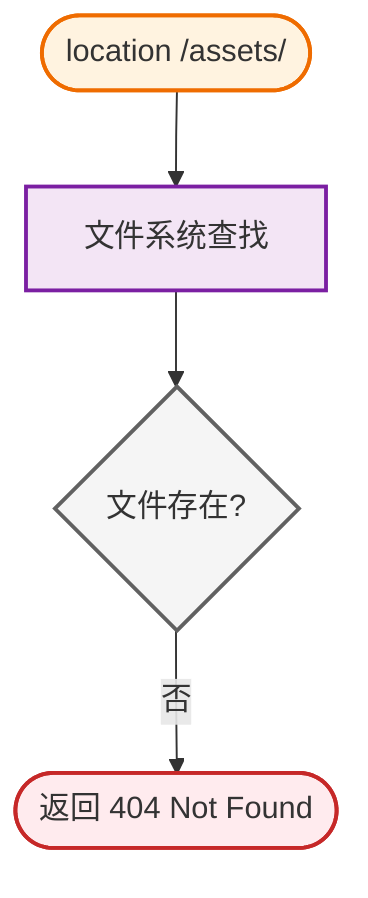

日志中可能看到：

```text
open() "/usr/share/nginx/html/assets/not-found.js" failed
```

而请求：

```text
/api/not-found
```

会命中：

```nginx
location /api/ {
    proxy_pass ...
}
```

流程变成：

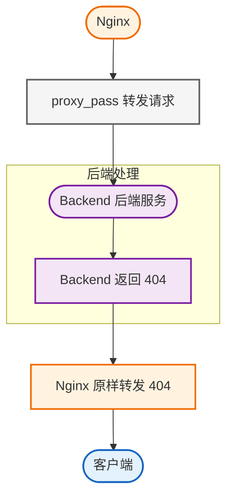

所以虽然都是 `404`，来源完全不同。你应该判断：

- 这是 Nginx 自己产生的 404？
- 还是 upstream 返回的 404？

## 四十四、可以通过日志增强判断

可以定义一个更适合排查静态资源和代理请求的日志格式：

```nginx
log_format main_ext
    '$remote_addr "$request" '
    'status=$status '
    'uri=$uri '
    'request_filename=$request_filename '
    'upstream_addr=$upstream_addr '
    'upstream_status=$upstream_status';

access_log /var/log/nginx/access.log main_ext;
```

这里非常有用的是 `$request_filename`。它能帮助观察 Nginx 计算出来的文件路径。

例如请求：

```text
/assets/index.js
```

可能记录：

```text
request_filename=/usr/share/nginx/html/assets/index.js
```

而 API 请求：

```text
/api/users
```

则：

```text
upstream_addr=172.x.x.x:3000
upstream_status=200
```

这样就很好区分：

```text
静态请求 vs 代理请求
```

## 四十五、403 又是怎么来的？

静态文件不仅可能返回 `404`，还可能返回 `403`。

常见情况是：文件存在，但是 Nginx worker 没有读取权限。

例如：

```bash
chmod 000 some-file.js
```

Nginx 读取文件时调用 `open()`，可能得到：

```text
Permission denied
```

返回：

```http
HTTP/1.1 403 Forbidden
```

可以先这样区分：

| 状态码 | 更可能的原因 |
| --- | --- |
| `404` | 文件不存在 / 路径配置错误 |
| `403` | 文件或目录权限问题 |

排查时执行：

```bash
ls -l
```

并同时检查父目录权限。

因为即使文件：

```text
-rw-r--r--
```

如果上级目录没有可执行权限 `x`，Nginx 也可能无法进入目录。
