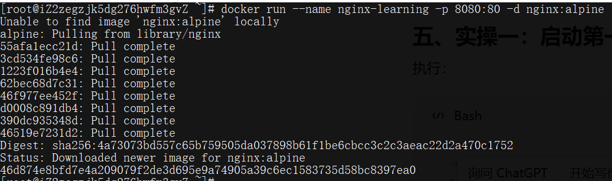

## 一、Nginx 到底是什么

Nginx 本质上是一个**接收网络请求并返回响应**的**服务器软件**。

最基础的场景是：

```text
浏览器
  ↓ HTTP 请求
Nginx
  ↓
读取静态文件
  ↓
返回 HTML、CSS、JS、图片
```

但在真实项目里，它通常位于用户和后端服务之间：

```text
用户浏览器
    ↓
Nginx
    ├── 返回前端静态文件
    ├── 转发请求给 Java / Node.js / Python 服务
    ├── 处理 HTTPS
    ├── 做负载均衡
    ├── 限流
    ├── 缓存
    └── 记录访问日志
```

你可以把 Nginx 理解成一个“流量入口管理员”。

它主要负责三类工作：

- 自己返回内容，例如 HTML、CSS、图片。
- 把请求转交给其他服务。
- 在请求进入系统前进行控制和处理。

注意：**Nginx 不等于后端业务服务**。

Nginx 一般不负责用户注册、订单计算、数据库查询等业务逻辑。它更像系统入口和交通调度员。

## 二、为什么现代开发仍然需要 Nginx

以前端项目为例，你执行：

```bash
npm run build
```

通常会生成：

```text
dist/
├── index.html
├── assets/
│   ├── index.js
│   └── index.css
```

这些文件必须通过 HTTP 服务提供给浏览器。

Nginx 可以负责：

```text
请求 /
返回 dist/index.html

请求 /assets/index.js
返回 dist/assets/index.js
```

同时，前端还需要调用后端：

```text
/api/user
```

Nginx 可以把它转发给：

```text
http://127.0.0.1:8080/api/user
```

于是用户只需要访问一个域名：

```text
https://example.com
```

而不是分别访问：

```text
前端：http://example.com
后端：http://example.com:8080
```

这就是 Nginx 在现代 Web 系统里的基础价值。

## 三、本章实操环境

为了减少操作系统差异，本章使用 Docker。

先检查：

```bash
docker --version
```

再检查 Docker 是否正常运行：

```bash
docker ps
```

如果这两个命令正常，就可以继续。

## 四、实操一：启动第一个 Nginx

执行：

```bash
docker run \
  --name nginx-learning \
  -p 8080:80 \
  -d nginx:alpine
```



查看容器：

```bash
docker ps
```

你应该看到类似：

```text
CONTAINER ID   IMAGE          PORTS                  NAMES
xxxxxx         nginx:alpine   0.0.0.0:8080->80/tcp   nginx-learning
```

然后访问：

```text
http://localhost:8080
```

如果看到 Nginx 欢迎页面，说明服务已经启动。

但不要停在这里。仅仅看到页面，不代表你懂了。

## 五、必须理解端口映射

启动命令中有：

```bash
-p 8080:80
```

它的含义是：

```text
宿主机端口 : 容器端口
8080       : 80
```

请求路径是：

```text
浏览器访问 localhost:8080
          ↓
宿主机监听 8080
          ↓
Docker 转发到容器 80
          ↓
Nginx 监听容器内 80
          ↓
Nginx 返回页面
```

不要把它理解成“把 Nginx 改成监听 8080”。

Nginx 在容器里仍然监听 80。只是 Docker 把宿主机的 8080 映射到了容器的 80。

## 六、实操二：查看 Nginx 进程

执行：

```bash
docker exec nginx-learning ps
```

执行结果为：

```text
PID   USER     TIME  COMMAND
    1 root      0:00 nginx: master process nginx -g daemon off;
   30 nginx     0:00 nginx: worker process
   31 nginx     0:00 nginx: worker process
   32 root      0:00 ps
```

Nginx 不是一个简单的单进程程序。

它通常包含：

```text
Master Process
    ├── Worker Process
    ├── Worker Process
    └── Worker Process
```

**Master 进程**

主要负责：

- 读取配置。
- 管理 Worker。
- 接收重新加载配置的信号。
- 启动或关闭 Worker。

**Worker 进程**

主要负责：

- 接收客户端连接。
- 处理 HTTP 请求。
- 返回响应。
- 转发请求。

可以暂时理解为：

```text
Master：管理人员
Worker：真正干活的人
```

## 七、实操三：查看完整配置

执行：

```bash
docker exec nginx-learning nginx -T
```

这个命令非常重要。

其中：

```bash
-T
```

表示：

- 检查配置语法。
- 输出当前完整配置。

你会看到主配置文件：

```text
/etc/nginx/nginx.conf
```

还可能看到：

```text
/etc/nginx/conf.d/default.conf
```

这是因为主配置通常会包含其他配置文件：

```nginx
include /etc/nginx/conf.d/*.conf;
```

配置关系大致是：

```text
/etc/nginx/nginx.conf
        ↓ include
/etc/nginx/conf.d/default.conf
```

所以不要形成一个错误认知：

> 所有配置都必须写在 nginx.conf 中。

真实项目中通常会拆分配置：

```text
nginx.conf
conf.d/
├── frontend.conf
├── api.conf
└── admin.conf
```

## 八、理解 Nginx 配置层级

一个最小配置可以写成：

```nginx
events {
}

http {
    server {
        listen 80;

        location / {
            root /usr/share/nginx/html;
            index index.html;
        }
    }
}
```

它的结构是：

```text
nginx
├── events
└── http
    └── server
        └── location
```

**events**

控制 Nginx 如何处理连接。

例如：

```nginx
events {
    worker_connections 1024;
}
```

目前先知道它是 Nginx 的必要配置块，不需要深入调优。

**http**

HTTP 服务的总配置区域。

```nginx
http {
}
```

与 HTTP 请求相关的配置通常都放在这里，例如：

- 日志。
- MIME 类型。
- 压缩。
- 缓存。
- 虚拟主机。
- 反向代理。

**server**

代表一个虚拟服务器或者一个站点。

```nginx
server {
    listen 80;
}
```

一个 Nginx 可以配置多个 server：

```nginx
server {
    server_name www.example.com;
}

server {
    server_name admin.example.com;
}
```

**location**

负责匹配请求路径。

```nginx
location / {
}
```

例如：

```nginx
location /api/ {
}
```

可以匹配：

```text
/api/user
/api/order
/api/product
```

当前先记住：

```text
server 决定请求进入哪个站点
location 决定请求在站点内部如何处理
```

## 九、实操四：替换默认首页

创建本地实验目录：

```bash
mkdir nginx-chapter-01
cd nginx-chapter-01
```

创建 `html/index.html`：

```html
<!DOCTYPE html>
<html lang="zh-CN">
<head>
  <meta charset="UTF-8">
  <title>Nginx 第一章</title>
</head>
<body>
  <h1>我的第一个 Nginx 页面</h1>
  <p>Nginx 静态资源服务已经运行成功。</p>
</body>
</html>
```

最终目录：

```text
nginx-chapter-01/
└── html/
    └── index.html
```

删除之前的容器：

```bash
docker rm -f nginx-learning
```

重新访问：

```text
http://localhost:8080
```

现在应该看到你自己编写的页面。

这里的挂载关系是：

```text
本地 html 目录
        ↓
容器 /usr/share/nginx/html
        ↓
Nginx 从该目录读取 index.html
```

`:ro` 表示只读挂载：

```text
read only
```

容器只能读取文件，不能修改宿主机目录。

## 十、实操五：编写自己的配置

创建目录：

```text
nginx-chapter-01/
├── html/
│   └── index.html
└── nginx/
    └── default.conf
```

`default.conf` 内容：

```nginx
server {
    listen 80;
    server_name localhost;

    location / {
        root /usr/share/nginx/html;
        index index.html;
    }

    location /hello {
        default_type text/plain;
        return 200 "Hello Nginx!\n";
    }
}
```

删除旧容器：

```bash
docker rm -f nginx-learning
```

Linux/macOS：

```bash
docker run \
  --name nginx-learning \
  -p 8080:80 \
  -v "$(pwd)/html:/usr/share/nginx/html:ro" \
  -v "$(pwd)/nginx/default.conf:/etc/nginx/conf.d/default.conf:ro" \
  -d nginx:alpine
```

分别访问：

```text
http://localhost:8080/
```

以及：

```text
http://localhost:8080/hello
```

预期结果：

```text
/       → 返回 index.html
/hello  → 返回 Hello Nginx!
```

## 十一、必须理解：root 和 index

配置：

```nginx
location / {
    root /usr/share/nginx/html;
    index index.html;
}
```

当请求：

```text
/
```

Nginx 最终会尝试读取：

```text
/usr/share/nginx/html/index.html
```

当请求：

```text
/test.html
```

Nginx 会尝试读取：

```text
/usr/share/nginx/html/test.html
```

大致规则是：

```text
root 路径 + 请求 URI
```

例如：

```text
root = /usr/share/nginx/html
URI  = /assets/app.js
```

最终文件路径：

```text
/usr/share/nginx/html/assets/app.js
```

`index index.html` 表示访问目录时，默认查找 `index.html`。

## 十二、实操六：故意制造配置错误

把配置改成：

```nginx
server {
    listen abc;
}
```

然后执行：

```bash
docker exec nginx-learning nginx -t
```

你会看到配置检查失败。

恢复正确配置：

```nginx
server {
    listen 80;
    server_name localhost;

    location / {
        root /usr/share/nginx/html;
        index index.html;
    }

    location /hello {
        default_type text/plain;
        return 200 "Hello Nginx!\n";
    }
}
```

再次检查：

```bash
docker exec nginx-learning nginx -t
```

正确结果通常包含：

```text
syntax is ok
test is successful
```

以后每次修改配置，都必须先执行：

```bash
nginx -t
```

不要直接重启。

正确习惯是：

```text
修改配置
   ↓
nginx -t
   ↓
配置正确
   ↓
nginx -s reload
```

## 十三、实操七：重新加载配置

把 `/hello` 改为：

```nginx
location /hello {
    default_type text/plain;
    return 200 "Nginx configuration reload success!\n";
}
```

检查配置：

```bash
docker exec nginx-learning nginx -t
```

重新加载：

```bash
docker exec nginx-learning nginx -s reload
```

再次访问：

```text
http://localhost:8080/hello
```

你应该看到新内容。

**reload 和 restart 的区别**

**Reload**

```bash
nginx -s reload
```

含义：

- 重新读取配置。
- 启动新的 Worker。
- 旧 Worker 处理完已有请求后退出。
- 尽可能不中断服务。

**Restart**

Docker 场景中：

```bash
docker restart nginx-learning
```

含义：

- 停止整个容器。
- 再重新启动。
- 期间可能出现短暂服务中断。

生产环境修改配置时，一般优先：

```bash
nginx -t && nginx -s reload
```

而不是无脑重启。

## 十四、实操八：查看日志

查看容器日志：

```bash
docker logs nginx-learning
```

持续查看：

```bash
docker logs -f nginx-learning
```

然后刷新：

```text
http://localhost:8080/
```

你会看到访问记录。

```text
172.17.0.1 - - [05/Aug/2026:10:00:00 +0000] "GET / HTTP/1.1" 200 182 "-" "Mozilla/5.0..."
```

重点观察：

```text
GET /
200
```

含义分别是：

```text
GET     请求方法
/       请求路径
200     HTTP 状态码
```

再访问一个不存在的路径：

```text
http://localhost:8080/not-found.html
```

日志中应该出现：

```text
2026/08/05 15:50:08 [error] 22#22: *5 open() "/usr/share/nginx/html/set.html" failed (2: No such file or directory),
```

这一步是在建立关键能力：

```text
页面出问题时，不要只看浏览器，要同时看 Nginx 日志。
```

## 十五、本章完整请求链路

```text
浏览器访问 http://localhost:8080/
            ↓
请求发送到宿主机 8080 端口
            ↓
Docker 将请求转发到容器 80 端口
            ↓
Nginx 的 server 监听 80 端口
            ↓
location / 匹配请求
            ↓
root 指向 /usr/share/nginx/html
            ↓
index 指定 index.html
            ↓
Nginx 读取文件
            ↓
返回 HTTP 200 和 HTML 内容
            ↓
浏览器渲染页面
```

这条链路比背几十个 Nginx 指令更重要。
